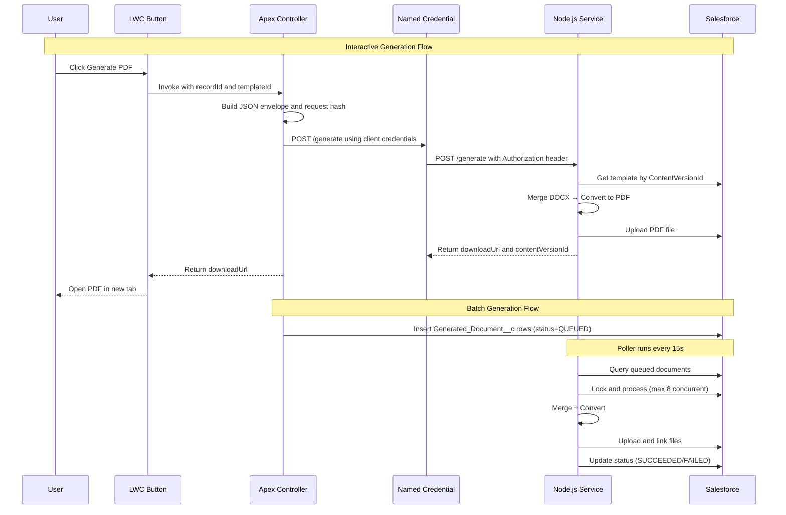

# Docgen - Salesforce PDF Generation Service

[](https://github.com/bigmantra/docgen/actions/workflows/ci.yml)
[](https://codecov.io/gh/bigmantra/docgen?flags[0]=nodejs)
[](https://codecov.io/gh/bigmantra/docgen?flags[0]=salesforce)
[](https://nodejs.org)
[](https://www.typescriptlang.org/)
[](https://opensource.org/licenses/MIT)
[](https://prettier.io/)
[](https://www.salesforce.com/)

A production-ready document generation service that creates PDF documents from Salesforce data using DOCX templates and LibreOffice, deployed on Azure Container Apps.

## Overview

Docgen enables both **interactive** and **batch** document generation directly from Salesforce records:

- **Interactive Generation**: Users click a Lightning Web Component button to instantly generate and download PDFs
- **Batch Processing**: Apex Batch/Queueable classes enqueue thousands of documents for background processing
- **Template-Based**: Use familiar Microsoft Word (DOCX) templates with merge fields for data population
- **Multi-Object Support**: Generate documents from Accounts, Opportunities, Cases, Contacts, Leads, and custom objects

## Architecture



## Key Features

- **Dual Processing Modes**: Interactive (synchronous) and batch (asynchronous) generation
- **Template Caching**: Immutable in-memory cache with LRU eviction (500 MB max)
- **PDF Conversion**: LibreOffice headless conversion with bounded concurrency (8 max per instance)
- **Idempotency**: SHA-256 request hash prevents duplicate generation within 24-hour window
- **Secure Authentication**: Azure AD OAuth2 inbound, Salesforce JWT Bearer outbound
- **Scalable**: Horizontal autoscaling (1-5 replicas) based on CPU utilization
- **Observable**: Azure Application Insights integration with custom metrics and distributed tracing
- **Multi-Parent Linking**: Automatically attach generated files to multiple related records
- **Retry Logic**: Exponential backoff for transient failures (1m → 5m → 15m)

## Quick Start

### Prerequisites

- Node.js 20+
- Salesforce CLI (for Apex development)
- Docker (for containerization)

### Installation

```bash
# Clone repository
git clone https://github.com/bigmantra/docgen.git
cd docgen

# Install dependencies
npm install

# Run tests
npm test

# Start development server
npm run dev
```

### Salesforce Setup

```bash
# Authenticate to Dev Hub
sf org login web --set-default-dev-hub --alias DevHub

# Set Azure AD credentials (required for backend authentication)
export AAD_CLIENT_ID="your-azure-ad-client-id"
export AAD_CLIENT_SECRET="your-azure-ad-client-secret"

# Create and configure scratch org (automated - includes AAD setup)
./scripts/setup-scratch-org.sh

# Or manually
sf org create scratch --definition-file config/project-scratch-def.json --alias docgen-dev --duration-days 7
sf project deploy start --source-dir force-app
sf org assign permset --name Docgen_User
./scripts/configure-external-credential.sh docgen-dev
```

### First Document Generation

1. **Upload a template**: Navigate to the Docgen app → Docgen Templates tab → Create new template with DOCX file
2. **Add LWC button**: Edit an Account/Opportunity/Case page → Drag `docgenButton` component onto the layout
3. **Generate**: Click "Generate Document" → Select template → Choose format → Generate

For detailed setup instructions, see [Quick Start Guide](docs/quick-start.md).

## Documentation

### For Developers

| Document | Description |
|----------|-------------|
| **[Quick Start Guide](docs/quick-start.md)** | Complete setup and installation guide for new developers |
| **[Scripts Reference](docs/scripts.md)** | Detailed documentation for all helper scripts and Apex templates |
| **[Architecture Guide](docs/architecture.md)** | Technical implementation details (authentication, caching, conversion, batch processing) |
| **[Testing Guide](docs/testing.md)** | Running tests (Node.js, Apex, LWC, E2E) and CI/CD configuration |
| **[API Reference](docs/api.md)** | REST API endpoints, request/response formats, error handling |
| **[Template Authoring](docs/template-authoring.md)** | Creating DOCX templates with merge fields, loops, and conditionals |
| **[Field Path Conventions](docs/field-path-conventions.md)** | Data structure and field path syntax |
| **[ADRs](docs/adr/)** | Architecture Decision Records (runtime, auth, worker, caching) |

### For Operations

| Document | Description |
|----------|-------------|
| **[Deployment Guide](docs/deploy.md)** | CI/CD workflows, deployment procedures, rollback strategies |
| **[Provisioning Guide](docs/provisioning.md)** | One-time environment setup in Azure |
| **[Runbooks](docs/runbooks.md)** | Operational procedures (scaling, key rotation, disaster recovery) |
| **[Monitoring & Dashboards](docs/dashboards.md)** | Application Insights dashboards, KQL queries, alert rules |
| **[Troubleshooting Index](docs/troubleshooting-index.md)** | Common issues and resolution steps |

### For Administrators

| Document | Description |
|----------|-------------|
| **[Admin Guide](docs/admin-guide.md)** | Salesforce admin setup, adding support for new objects |
| **[Admin Runbook](docs/admin-runbook.md)** | Administrative operations and troubleshooting |
| **[Named Credential Setup](docs/named-credential-setup.md)** | Configuring Azure AD authentication from Salesforce |

## Project Structure

```
docgen/
├── src/                    # Node.js TypeScript source
│   ├── auth/              # Azure AD authentication
│   ├── sf/                # Salesforce API client
│   ├── templates/         # Template cache and merging
│   ├── convert/           # LibreOffice conversion pool
│   ├── worker/            # Batch poller service
│   ├── obs/               # Observability (metrics, tracing)
│   └── routes/            # API endpoints
├── force-app/             # Salesforce metadata
│   └── main/default/
│       ├── classes/       # Apex (controllers, services, batch)
│       ├── lwc/           # Lightning Web Components
│       ├── objects/       # Custom objects and fields
│       └── tabs/          # Custom tabs
├── test/                  # Jest tests
├── e2e/                   # Playwright E2E tests
├── docs/                  # Documentation
├── infra/                 # Bicep infrastructure templates
└── .github/workflows/     # CI/CD workflows
```

## Salesforce Components

### Custom Objects
- **Docgen_Template__c**: Template configuration (links to ContentVersion)
- **Generated_Document__c**: Document generation tracking and status
- **Supported_Object__mdt**: Multi-object configuration (Custom Metadata)

### Apex Classes
- **DocgenController**: Interactive generation controller for LWC
- **DocgenEnvelopeService**: Request envelope builder with SHA-256 hashing
- **StandardSOQLProvider**: Data collection with locale-aware formatting
- **BatchDocgenEnqueue**: Batch processing for mass generation

**Test Coverage**: 112 Apex tests with 86% code coverage

### Lightning Web Components
- **docgenButton**: Document generation button (deployable to any record page)
- **docgenTestPage**: E2E testing wrapper component

### Custom App
The **Docgen** app includes:
- Docgen Templates tab (manage templates)
- Generated Documents tab (track generation history)
- Docgen Test Page tab (E2E testing interface)

## Technology Stack

| Layer | Technology |
|-------|------------|
| **Runtime** | Node.js 20+ with TypeScript |
| **Web Framework** | Fastify |
| **Template Engine** | docx-templates |
| **PDF Conversion** | LibreOffice (headless) |
| **Authentication** | Azure AD OAuth2 (inbound), Salesforce JWT Bearer (outbound) |
| **Testing** | Jest, Supertest, Nock, Playwright |
| **Infrastructure** | Azure Container Apps, Azure Container Registry, Azure Key Vault |
| **Observability** | Azure Application Insights, OpenTelemetry |
| **CI/CD** | GitHub Actions |

## API Endpoints

### Health & Readiness
- **GET /healthz**: Liveness probe (always returns 200)
- **GET /readyz**: Readiness probe with dependency checks

### Document Generation
- **POST /generate**: Generate PDF/DOCX from template (requires Azure AD token)

### Worker Management
- **POST /worker/start**: Start batch poller
- **POST /worker/stop**: Stop batch poller gracefully
- **GET /worker/status**: Current worker state
- **GET /worker/stats**: Detailed worker metrics

See [API Reference](docs/api.md) for complete endpoint documentation.

## Contributing

We welcome contributions! To get started:

1. Fork the repository
2. Create a feature branch (`git checkout -b feature/amazing-feature`)
3. Make your changes and add tests
4. Run tests and linting (`npm test && npm run lint`)
5. Commit your changes (`git commit -m 'Add amazing feature'`)
6. Push to the branch (`git push origin feature/amazing-feature`)
7. Open a Pull Request

### Code Style

- **TypeScript**: Strict mode enabled
- **Linting**: ESLint with Prettier
- **Testing**: Jest with 80%+ coverage target
- **Commits**: Conventional Commits format

## License

MIT - see [LICENSE](LICENSE) file for details.

## Support

- **Documentation**: [docs/](docs/)
- **GitHub Issues**: [https://github.com/bigmantra/docgen/issues](https://github.com/bigmantra/docgen/issues)
- **Architecture Decisions**: [docs/adr/](docs/adr/)

---

**Built with** ❤️ **by the Docgen team**
