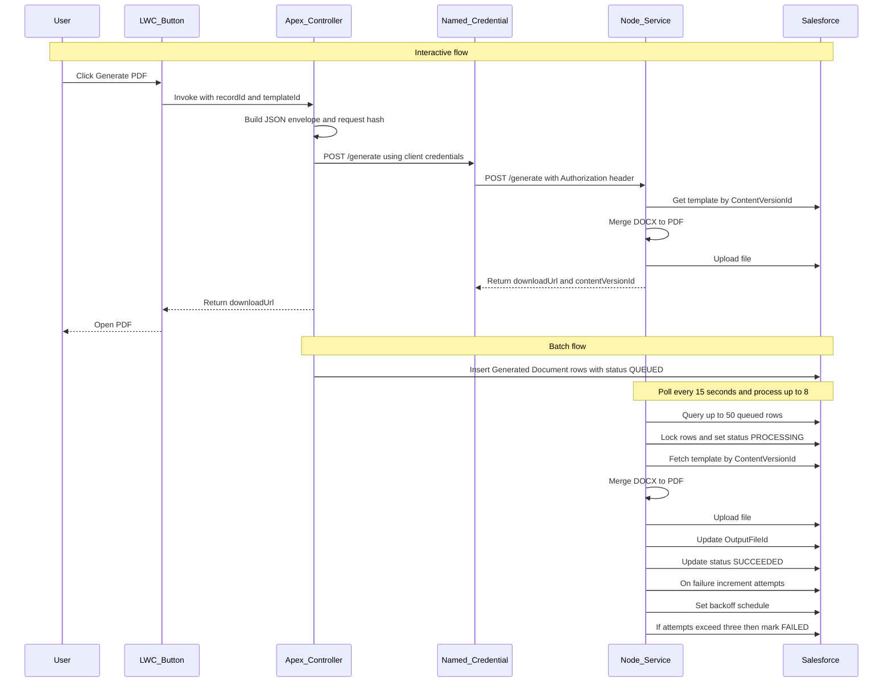

# Docgen - Salesforce PDF Generation Service

[](https://github.com/bigmantra/docgen/actions/workflows/ci.yml)
[](https://codecov.io/gh/bigmantra/docgen?flags[0]=nodejs)
[](https://codecov.io/gh/bigmantra/docgen?flags[0]=salesforce)
[](https://nodejs.org)
[](https://www.typescriptlang.org/)
[](https://opensource.org/licenses/MIT)
[](https://prettier.io/)
[](https://www.salesforce.com/)

A Node.js-based document generation service that creates PDF documents from Salesforce data using docx-templates and LibreOffice, deployed on Azure Container Apps.

## Architecture Overview



## Features

- **Interactive Document Generation**: User-initiated via LWC button with immediate download
- **Batch Processing**: Mass document generation via Apex Batch/Queueable with polling worker
- **Template-Based**: Uses DOCX templates with field-path substitution via docx-templates
- **PDF Conversion**: LibreOffice headless conversion with bounded concurrency (8 max per instance)
- **Idempotency**: RequestHash-based deduplication prevents duplicate work
- **Secure**: AAD OAuth2 inbound (T-08 ✅), JWT Bearer Flow outbound to Salesforce (T-09)
- **Scalable**: Horizontal scaling on Azure Container Apps with distributed locking
- **Observable**: Azure Application Insights integration with correlation IDs and custom metrics

## Quick Start

### Prerequisites

- Node.js 20+ (see `.nvmrc`)
- npm or yarn
- Salesforce CLI (sfdx) for Apex development
- Docker (for containerization)

### Installation

```bash
# Install dependencies
npm install

# Run tests
npm test

# Run in development mode
npm run dev

# Build for production
npm run build

# Start production server
npm start
```

### Salesforce Setup

This project includes Salesforce custom objects and Apex code. To set up a scratch org for development:

```bash
# Authenticate to your Dev Hub (one-time setup)
sf org login web --set-default-dev-hub --alias DevHub

# Create and configure a scratch org
./scripts/setup-scratch-org.sh

# Or manually:
sf org create scratch --definition-file config/project-scratch-def.json --alias docgen-dev --set-default --duration-days 7
sf project deploy start --source-dir force-app
sf apex run test --test-level RunLocalTests --result-format human
```

**Helper Scripts**:
- `scripts/setup-scratch-org.sh [alias]` - Create and deploy to scratch org
- `scripts/deploy-to-org.sh [alias]` - Deploy metadata to existing org
- `scripts/run-apex-tests.sh [alias]` - Run Apex tests
- `scripts/delete-scratch-org.sh [alias]` - Delete scratch org

**Salesforce Components**:
- `Docgen_Template__c` - Template configuration object (7 fields)
- `Generated_Document__c` - Document generation tracking object (15 fields)
- `DocgenDataProvider` - Interface for pluggable data collection strategies
- `StandardSOQLProvider` - Default SOQL provider with locale-aware formatting
- `DocgenEnvelopeService` - JSON envelope builder with SHA-256 RequestHash
- `DocgenController` - Interactive document generation controller (calls Node API via Named Credential)
- Apex test classes: 6 test classes with 44 test methods (all passing)

### Named Credential Setup

The service uses a Salesforce Named Credential to securely authenticate API calls to the Node.js service using Azure AD OAuth 2.0 client credentials.

**Quick Setup**:

1. **Deploy metadata**:
   ```bash
   sf project deploy start --source-dir force-app/main/default/externalCredentials,force-app/main/default/namedCredentials
   ```

2. **Configure External Credential** (via Salesforce UI):
   - Go to **Setup → Named Credentials → External Credentials**
   - Edit `Docgen_AAD_Credential`
   - Add Principal: `DocgenAADPrincipal`
   - Add Client ID: `f42d24be-0a17-4a87-bfc5-d6cd84339302` (from `azure-ad-config.md`)
   - Add Client Secret: See `azure-ad-config.md` (⚠️ expires 2027-11-06)

3. **Update Named Credential URL**:
   - Go to **Setup → Named Credentials → Named Credentials**
   - Edit `Docgen_Node_API`
   - Set URL based on environment:
     - **Local**: `http://localhost:8080` (tests only; Salesforce can't reach localhost)
     - **Dev/Sandbox**: Ngrok tunnel or dev Azure deployment
     - **Production**: Azure Container Apps URL (configured in T-16)

4. **Test authentication**:
   ```apex
   HttpRequest req = new HttpRequest();
   req.setEndpoint('callout:Docgen_Node_API/healthz');
   req.setMethod('GET');
   Http http = new Http();
   HTTPResponse res = http.send(req);
   System.debug('Status: ' + res.getStatusCode()); // Should be 200
   ```

**📖 Full Documentation**: See [docs/named-credential-setup.md](docs/named-credential-setup.md) for detailed step-by-step instructions, troubleshooting, and security best practices.

**🔐 Azure AD Configuration**: See `azure-ad-config.md` (not in git) for tenant ID, client ID, endpoints, and secrets.

### Environment Variables

```bash
PORT=8080
NODE_ENV=development
SF_DOMAIN=<your-salesforce-instance>.my.salesforce.com
AZURE_TENANT_ID=<azure-tenant-id>
CLIENT_ID=<azure-client-id>
KEY_VAULT_URI=<azure-key-vault-uri>
IMAGE_ALLOWLIST=cdn.example.com,images.company.com

# Azure AD JWT Validation (T-08)
ISSUER=https://login.microsoftonline.com/<azure-tenant-id>/v2.0
AUDIENCE=api://<azure-client-id>
JWKS_URI=https://login.microsoftonline.com/<azure-tenant-id>/discovery/v2.0/keys

# Optional: Bypass auth in development
AUTH_BYPASS_DEVELOPMENT=true  # Only works when NODE_ENV=development
```

## Authentication (T-08)

### Azure AD JWT Validation

The service uses Azure AD (Entra ID) OAuth 2.0 for inbound authentication from Salesforce:

- **Protocol**: OAuth 2.0 Client Credentials Flow
- **Token Type**: JWT (RS256)
- **Validation**: JWKS-based signature verification with caching
- **Claims**: Validates issuer, audience, expiry, and not-before times

#### Implementation Details

**Core Components**:
- `src/auth/aad.ts` - AAD JWT verifier with JWKS client
- `src/plugins/auth.ts` - Fastify authentication plugin
- `/generate` endpoint - Protected with `preHandler: fastify.authenticate`
- `/readyz` endpoint - Includes JWKS connectivity check

**Security Features**:
- JWKS key caching (5 minutes) to reduce external calls
- Rate limiting (10 JWKS requests/minute)
- Correlation ID propagation in auth failures
- Development mode bypass (NODE_ENV=development + AUTH_BYPASS_DEVELOPMENT=true)

**Error Responses**:
- `401 Unauthorized` - Missing/expired/invalid token
- `403 Forbidden` - Wrong audience or issuer

## Template Cache & Merging (T-10)

### Template Caching

The service implements an immutable in-memory template cache per ADR-0004:

**Key Features**:
- **Immutable Caching**: Templates are cached by `ContentVersionId` with infinite TTL (ContentVersions are immutable in Salesforce)
- **LRU Eviction**: When cache exceeds 500 MB, least-recently-used templates are evicted
- **Cache Statistics**: Tracks hits, misses, evictions, size, and entry count
- **Thread-Safe**: Synchronous operations safe for single Node.js process

**Implementation**:
```typescript
// src/templates/cache.ts
export class TemplateCache {
  get(contentVersionId: string): Buffer | undefined
  set(contentVersionId: string, buffer: Buffer): void
  getStats(): TemplateCacheStats
  clear(): void
}
```

**Metrics**:
- `hits` - Number of cache hits
- `misses` - Number of cache misses (triggers Salesforce download)
- `evictions` - Number of LRU evictions
- `currentSize` - Total cache size in bytes
- `entryCount` - Number of cached templates

### Template Merging

The service uses the `docx-templates` library to merge Salesforce data with DOCX templates:

**Supported Features**:
- **Field Paths**: Salesforce API-style paths (e.g., `{{Account.Name}}`, `{{Opportunity.Owner.Name}}`)
- **Formatted Values**: Apex pre-formats currency, dates, numbers using `__formatted` suffix
- **Loops**: `{{#each Opportunity.LineItems}}...{{/each}}` for arrays
- **Conditionals**: `{{#if Account.IsPartner}}...{{/if}}` for boolean logic
- **Images**: Base64-encoded (preferred) or external URLs (allowlist validated)

**Example Template**:
```
Customer: {{Account.Name}}
Revenue: {{Account.AnnualRevenue__formatted}}

{{#each Opportunity.LineItems}}
  - {{Name}}: {{Quantity}} x {{UnitPrice__formatted}} = {{TotalPrice__formatted}}
{{/each}}

{{#if Account.IsPartner}}
  Partner Discount: 15%
{{/if}}
```

**Image Allowlist**:

External image URLs must be on the allowlist (configured via `IMAGE_ALLOWLIST` env var):

```bash
IMAGE_ALLOWLIST=cdn.example.com,images.company.com
```

- **Base64 images** (recommended): No validation needed, included directly in data
- **External URLs**: Validated against allowlist to prevent SSRF attacks

**Template Service Flow**:

1. Check cache for template by `ContentVersionId`
2. On miss: Download from Salesforce via `/services/data/v59.0/sobjects/ContentVersion/{Id}/VersionData`
3. Store in cache
4. Merge template with data using `docx-templates`
5. Return merged DOCX buffer

**Documentation**:
- [Template Authoring Guide](./docs/template-authoring.md) - Complete guide with examples
- [ADR-0004: Caching & Idempotency](./docs/adr/0004-caching-idempotency.md)

## Project Structure

```
docgen/
├── src/              # TypeScript source code
│   ├── auth/         # Azure AD JWT authentication (T-08)
│   ├── sf/           # Salesforce client (JWT Bearer + API) (T-09)
│   ├── templates/    # Template cache, service, and merge (T-10)
│   ├── routes/       # Fastify routes
│   ├── plugins/      # Fastify plugins
│   ├── config/       # Configuration management
│   └── utils/        # Utility functions (image allowlist)
├── test/             # Jest tests
│   ├── templates/    # Template cache, service, merge tests
│   └── helpers/      # Test utilities (JWT helpers)
├── force-app/        # Salesforce Apex and metadata
├── docs/             # Documentation and ADRs
│   └── template-authoring.md  # Template authoring guide
└── dist/             # Compiled JavaScript (gitignored)
```

## Testing

### Node.js Tests

```bash
# Run all tests
npm test

# Run tests in watch mode
npm run test:watch

# Run tests with coverage
npm run test:coverage
```

### Salesforce Apex Tests

```bash
# Run Apex tests in scratch org
./scripts/run-apex-tests.sh

# Or manually
sf apex run test --test-level RunLocalTests --code-coverage --result-format human
```

### LWC Tests

```bash
# Run Lightning Web Component tests
npm run test:lwc

# Run in watch mode
npm run test:lwc:watch

# Run with coverage
npm run test:lwc:coverage
```

### E2E Tests (Playwright)

End-to-end tests verify the `docgenButton` LWC component in a real Salesforce environment (UI-only, no backend required).

```bash
# Step 1: Create scratch org and deploy metadata
npm run e2e:setup

# Step 2: Run Playwright E2E tests
npm run test:e2e

# Step 3: View test results
npm run test:e2e:report

# Step 4: Clean up scratch org
npm run e2e:teardown
```

**Available test modes**:
```bash
npm run test:e2e          # Headless (default)
npm run test:e2e:headed   # Watch browser execute
npm run test:e2e:ui       # Interactive mode
npm run test:e2e:debug    # Debug with Playwright Inspector
```

**What's tested**:
- ✅ Component rendering and visibility
- ✅ Button state management (enabled/disabled)
- ✅ Spinner during processing
- ✅ Success/error toast notifications
- ✅ Salesforce record creation (Generated_Document__c)
- ✅ Account page loading

**See also**:
- [E2E Testing Guide](./e2e/README.md) - Setup, running tests, troubleshooting
- [E2E Architecture](./docs/e2e-testing.md) - Design decisions, patterns, CI/CD

## Continuous Integration

The project includes GitHub Actions workflows that automatically:

1. **Node.js CI** (`test` job):
   - Runs ESLint
   - Runs Jest tests with coverage
   - Type checks TypeScript
   - Builds the project

2. **Salesforce CI** (`salesforce` job):
   - Creates a scratch org
   - Deploys all metadata
   - Runs Apex tests
   - Cleans up scratch org

To enable Salesforce CI in GitHub Actions:

```bash
# 1. Authenticate to your Dev Hub
sf org login web --set-default-dev-hub --alias DevHub

# 2. Get the auth URL
sf org display --verbose --target-org DevHub

# 3. Copy the "Sfdx Auth Url" value

# 4. Add it as a GitHub secret named SFDX_AUTH_URL
# Go to: Settings → Secrets and variables → Actions → New repository secret
```

## API Endpoints

### Health & Readiness

- **GET /healthz**: Liveness probe (always returns 200)
- **GET /readyz**: Readiness probe (returns 200 when dependencies healthy, 503 otherwise)

### Document Generation

#### POST /generate

Generate a PDF or DOCX document from a Salesforce template.

**Authentication**: Azure AD OAuth2 Bearer token (client credentials from Salesforce Named Credential)

**Request Body**:
```json
{
  "templateId": "068xx000000abcdXXX",
  "outputFileName": "Account_Summary_{{Account.Name}}.pdf",
  "outputFormat": "PDF",
  "locale": "en-GB",
  "timezone": "Europe/London",
  "options": {
    "storeMergedDocx": false,
    "returnDocxToBrowser": false
  },
  "parents": {
    "AccountId": "001xx000000abcdXXX",
    "OpportunityId": null,
    "CaseId": null
  },
  "data": {
    "Account": {
      "Name": "Acme Ltd",
      "AnnualRevenue__formatted": "£1,200,000"
    }
  },
  "requestHash": "sha256:..."
}
```

**Success Response** (200):
```json
{
  "downloadUrl": "https://example.my.salesforce.com/sfc/servlet.shepherd/version/download/068xx...",
  "contentVersionId": "068xx000000abcdXXX",
  "correlationId": "12345678-1234-4567-89ab-123456789012"
}
```

**Accepted Response** (202) - Async processing:
```json
{
  "correlationId": "12345678-1234-4567-89ab-123456789012",
  "message": "Document generation request accepted"
}
```

**Validation Error** (400):
```json
{
  "statusCode": 400,
  "error": "Bad Request",
  "message": "body must have required property 'templateId'"
}
```

**See Also**:
- [OpenAPI Specification](./openapi.yaml) - Complete API documentation
- [Field Path Conventions](./docs/field-path-conventions.md) - Template data structure guide
- [Sample Payloads](./samples/) - Example requests for Account, Opportunity, and Case

## Documentation

- [OpenAPI Specification](./openapi.yaml)
- [Field Path Conventions](./docs/field-path-conventions.md)
- [Architecture Decision Records (ADRs)](./docs/adr/)
- [Development Context](./development-context.md)
- [Development Tasks](./development-tasks.md)

## Technology Stack

- **Runtime**: Node.js 20+ with TypeScript
- **Web Framework**: Fastify
- **Testing**: Jest + ts-jest + Supertest + Nock
- **Document Processing**: docx-templates + LibreOffice
- **Authentication**: Azure AD (inbound), JWT Bearer (outbound to Salesforce)
- **Hosting**: Azure Container Apps (UK South, 2 vCPU / 4 GB RAM)
- **Observability**: Azure Application Insights

## License

MIT
