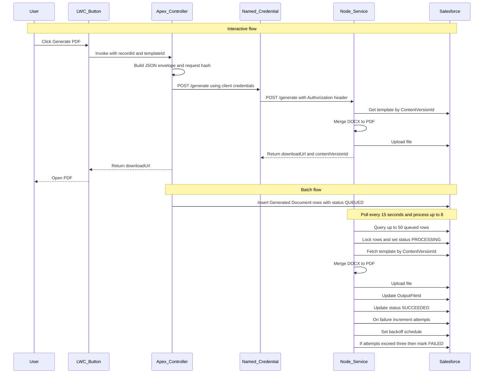

# Docgen - Salesforce PDF Generation Service

A Node.js-based document generation service that creates PDF documents from Salesforce data using docx-templates and LibreOffice, deployed on Azure Container Apps.

## Architecture Overview



## Features

- **Interactive Document Generation**: User-initiated via LWC button with immediate download
- **Batch Processing**: Mass document generation via Apex Batch/Queueable with polling worker
- **Template-Based**: Uses DOCX templates with field-path substitution via docx-templates
- **PDF Conversion**: LibreOffice headless conversion with bounded concurrency (8 max per instance)
- **Idempotency**: RequestHash-based deduplication prevents duplicate work
- **Secure**: AAD OAuth2 inbound, JWT Bearer Flow outbound to Salesforce
- **Scalable**: Horizontal scaling on Azure Container Apps with distributed locking
- **Observable**: Azure Application Insights integration with correlation IDs and custom metrics

## Quick Start

### Prerequisites

- Node.js 20+ (see `.nvmrc`)
- npm or yarn
- Salesforce CLI (sfdx) for Apex development
- Docker (for containerization)

### Installation

```bash
# Install dependencies
npm install

# Run tests
npm test

# Run in development mode
npm run dev

# Build for production
npm run build

# Start production server
npm start
```

### Salesforce Setup

This project includes Salesforce custom objects and Apex code. To set up a scratch org for development:

```bash
# Authenticate to your Dev Hub (one-time setup)
sf org login web --set-default-dev-hub --alias DevHub

# Create and configure a scratch org
./scripts/setup-scratch-org.sh

# Or manually:
sf org create scratch --definition-file config/project-scratch-def.json --alias docgen-dev --set-default --duration-days 7
sf project deploy start --source-dir force-app
sf apex run test --test-level RunLocalTests --result-format human
```

**Helper Scripts**:
- `scripts/setup-scratch-org.sh [alias]` - Create and deploy to scratch org
- `scripts/deploy-to-org.sh [alias]` - Deploy metadata to existing org
- `scripts/run-apex-tests.sh [alias]` - Run Apex tests
- `scripts/delete-scratch-org.sh [alias]` - Delete scratch org

**Salesforce Components**:
- `Docgen_Template__c` - Template configuration object (7 fields)
- `Generated_Document__c` - Document generation tracking object (15 fields)
- `DocgenDataProvider` - Interface for pluggable data collection strategies
- `StandardSOQLProvider` - Default SOQL provider with locale-aware formatting
- `DocgenEnvelopeService` - JSON envelope builder with SHA-256 RequestHash
- Apex test classes: `DocgenTemplateTest`, `GeneratedDocumentTest`, `StandardSOQLProviderTest`, `DocgenEnvelopeServiceTest` (38/38 tests passing)

### Environment Variables

```bash
PORT=8080
NODE_ENV=development
SF_DOMAIN=<your-salesforce-instance>.my.salesforce.com
AZURE_TENANT_ID=<azure-tenant-id>
CLIENT_ID=<azure-client-id>
KEY_VAULT_URI=<azure-key-vault-uri>
IMAGE_ALLOWLIST=cdn.example.com,images.company.com
```

## Project Structure

```
docgen/
├── src/              # TypeScript source code
│   ├── routes/       # Fastify routes
│   ├── plugins/      # Fastify plugins
│   ├── config/       # Configuration management
│   └── utils/        # Utility functions
├── test/             # Jest tests
├── force-app/        # Salesforce Apex and metadata
├── docs/             # Documentation and ADRs
└── dist/             # Compiled JavaScript (gitignored)
```

## Testing

### Node.js Tests

```bash
# Run all tests
npm test

# Run tests in watch mode
npm run test:watch

# Run tests with coverage
npm run test:coverage
```

### Salesforce Apex Tests

```bash
# Run Apex tests in scratch org
./scripts/run-apex-tests.sh

# Or manually
sf apex run test --test-level RunLocalTests --code-coverage --result-format human
```

## Continuous Integration

The project includes GitHub Actions workflows that automatically:

1. **Node.js CI** (`test` job):
   - Runs ESLint
   - Runs Jest tests with coverage
   - Type checks TypeScript
   - Builds the project

2. **Salesforce CI** (`salesforce` job):
   - Creates a scratch org
   - Deploys all metadata
   - Runs Apex tests
   - Cleans up scratch org

To enable Salesforce CI in GitHub Actions:

```bash
# 1. Authenticate to your Dev Hub
sf org login web --set-default-dev-hub --alias DevHub

# 2. Get the auth URL
sf org display --verbose --target-org DevHub

# 3. Copy the "Sfdx Auth Url" value

# 4. Add it as a GitHub secret named SFDX_AUTH_URL
# Go to: Settings → Secrets and variables → Actions → New repository secret
```

## API Endpoints

### Health & Readiness

- **GET /healthz**: Liveness probe (always returns 200)
- **GET /readyz**: Readiness probe (returns 200 when dependencies healthy, 503 otherwise)

### Document Generation

#### POST /generate

Generate a PDF or DOCX document from a Salesforce template.

**Authentication**: Azure AD OAuth2 Bearer token (client credentials from Salesforce Named Credential)

**Request Body**:
```json
{
  "templateId": "068xx000000abcdXXX",
  "outputFileName": "Account_Summary_{{Account.Name}}.pdf",
  "outputFormat": "PDF",
  "locale": "en-GB",
  "timezone": "Europe/London",
  "options": {
    "storeMergedDocx": false,
    "returnDocxToBrowser": false
  },
  "parents": {
    "AccountId": "001xx000000abcdXXX",
    "OpportunityId": null,
    "CaseId": null
  },
  "data": {
    "Account": {
      "Name": "Acme Ltd",
      "AnnualRevenue__formatted": "£1,200,000"
    }
  },
  "requestHash": "sha256:..."
}
```

**Success Response** (200):
```json
{
  "downloadUrl": "https://example.my.salesforce.com/sfc/servlet.shepherd/version/download/068xx...",
  "contentVersionId": "068xx000000abcdXXX",
  "correlationId": "12345678-1234-4567-89ab-123456789012"
}
```

**Accepted Response** (202) - Async processing:
```json
{
  "correlationId": "12345678-1234-4567-89ab-123456789012",
  "message": "Document generation request accepted"
}
```

**Validation Error** (400):
```json
{
  "statusCode": 400,
  "error": "Bad Request",
  "message": "body must have required property 'templateId'"
}
```

**See Also**:
- [OpenAPI Specification](./openapi.yaml) - Complete API documentation
- [Field Path Conventions](./docs/field-path-conventions.md) - Template data structure guide
- [Sample Payloads](./samples/) - Example requests for Account, Opportunity, and Case

## Documentation

- [OpenAPI Specification](./openapi.yaml)
- [Field Path Conventions](./docs/field-path-conventions.md)
- [Architecture Decision Records (ADRs)](./docs/adr/)
- [Development Context](./development-context.md)
- [Development Tasks](./development-tasks.md)

## Technology Stack

- **Runtime**: Node.js 20+ with TypeScript
- **Web Framework**: Fastify
- **Testing**: Jest + ts-jest + Supertest + Nock
- **Document Processing**: docx-templates + LibreOffice
- **Authentication**: Azure AD (inbound), JWT Bearer (outbound to Salesforce)
- **Hosting**: Azure Container Apps (UK South, 2 vCPU / 4 GB RAM)
- **Observability**: Azure Application Insights

## License

ISC
