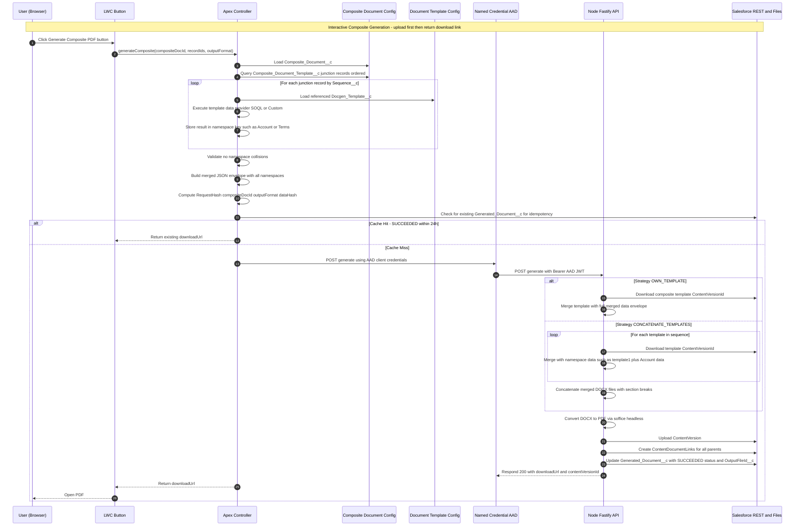
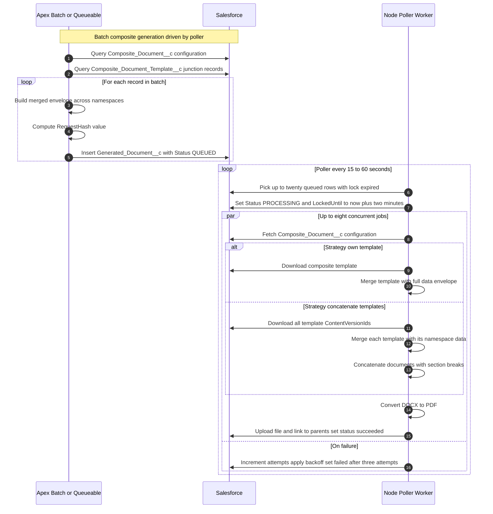

# Composite Document Feature - Developer Playbook

## Mermaid Sequence Diagrams

### Interactive Flow - Composite Document Generation



### Batch Flow - Composite Document Generation



---

## Task Breakdown

### T-18 — Salesforce Object Schema: Composite Document & Junction

**Goal**: Create `Composite_Document__c` custom object and `Composite_Document_Template__c` junction object to enable many-to-many relationships between composites and templates.

**Why it matters**: Foundation for all composite document functionality. Establishes data model for configuration-driven multi-source generation without hardcoding relationships.

**Prereqs/Dependencies**: T-04 (Docgen_Template__c and Generated_Document__c exist)

**Steps (TDD-first)**:

1) **Write Apex tests FIRST** (TDD):
   - `CompositeDocumentTest.cls`: Test required fields, validation rules
   - `CompositeDocumentTemplateTest.cls`: Test junction unique constraint (Composite + Namespace)
   - Test cascade behavior (deleting composite does NOT delete templates due to Lookup)
   - Test loading junction records ordered by Sequence__c
   - Test inactive junction records are filtered

2) **Create Composite_Document__c object**:
   - Create object metadata: `force-app/main/default/objects/Composite_Document__c/Composite_Document__c.object-meta.xml`
   - Fields:
     - `Name` (Text 80, Auto-number: CD-{00000})
     - `Description__c` (Long Text Area, 32,768)
     - `Template_Strategy__c` (Picklist: "Own Template", "Concatenate Templates")
     - `TemplateContentVersionId__c` (Text 18, required when Strategy = "Own Template")
     - `StoreMergedDocx__c` (Checkbox, default false)
     - `ReturnDocxToBrowser__c` (Checkbox, default false)
     - `PrimaryParent__c` (Unrestricted Picklist with suggestions: Account, Opportunity, Case, Contact, Lead)
     - `IsActive__c` (Checkbox, default true)
   - Validation rules:
     - `Template_Required_For_Own_Strategy`: When `Template_Strategy__c = "Own Template"`, require `TemplateContentVersionId__c`
     - `Template_Forbidden_For_Concatenate`: When `Template_Strategy__c = "Concatenate Templates"`, `TemplateContentVersionId__c` must be blank

3) **Create Composite_Document_Template__c junction object**:
   - Create object metadata
   - Fields:
     - `Name` (Auto-number: CDT-{00000})
     - `Composite_Document__c` (Lookup to Composite_Document__c, required)
     - `Document_Template__c` (Lookup to Docgen_Template__c, required)
     - `Namespace__c` (Text 80, required, help text: "Data key in merged JSON (e.g., 'Account', 'Opportunities', 'Terms')")
     - `Sequence__c` (Number 3,0, required, help text: "Execution order for data providers and concatenation order for DOCX")
     - `IsActive__c` (Checkbox, default true)
   - Unique constraint: External ID on formula field `Unique_Key__c = TEXT(Composite_Document__c) & '|' & Namespace__c`
   - Compact layout: Name, Namespace, Sequence, IsActive

4) **Update Generated_Document__c object**:
   - Add field: `Composite_Document__c` (Lookup to Composite_Document__c)
   - Update validation rule: Require `Template__c` OR `Composite_Document__c` (not both, not neither)
   - Add to page layouts

5) **Update Docgen_User permission set**:
   - Grant Read on Composite_Document__c (all fields)
   - Grant Read on Composite_Document_Template__c (all fields)
   - Grant Read/Edit on Generated_Document__c.Composite_Document__c

6) **Run tests** - All 5 test scenarios must pass

**Behavioural tests (Given/When/Then)**:

- **Given** a Composite_Document__c with Strategy = "Own Template"
  **When** TemplateContentVersionId__c is blank
  **Then** validation rule fires and save fails

- **Given** a Composite_Document__c with Strategy = "Concatenate Templates"
  **When** TemplateContentVersionId__c is populated
  **Then** validation rule fires and save fails

- **Given** two Composite_Document_Template__c records with same Composite_Document__c and Namespace__c
  **When** attempting to insert the second record
  **Then** unique constraint violation occurs

- **Given** 3 junction records with Sequence__c values 10, 5, 20
  **When** querying with ORDER BY Sequence__c
  **Then** records return in order: 5, 10, 20

- **Given** a Generated_Document__c record
  **When** both Template__c and Composite_Document__c are null
  **Then** validation rule fires

**Artifacts to commit**:
- `force-app/main/default/objects/Composite_Document__c/` (12 files: object meta, 8 fields, 2 validation rules, compact layout)
- `force-app/main/default/objects/Composite_Document_Template__c/` (8 files: object meta, 6 fields, compact layout)
- `force-app/main/default/objects/Generated_Document__c/fields/Composite_Document__c.field-meta.xml`
- `force-app/main/default/objects/Generated_Document__c/validationRules/Require_Template_Or_Composite.validationRule-meta.xml`
- `force-app/main/default/permissionsets/Docgen_User.permissionset-meta.xml` (updated)
- `force-app/main/default/classes/CompositeDocumentTest.cls` (5 test methods)
- `force-app/main/default/classes/CompositeDocumentTemplateTest.cls` (5 test methods)

**Definition of Done**:
- [x] All fields created with correct data types and help text
- [x] Validation rules enforce business logic
- [x] Unique constraint enforced programmatically (formula fields cannot be unique external IDs)
- [x] 10 Apex tests pass (100% coverage on validation rules)
- [x] Permission set grants correct access
- [x] Can deploy to scratch org successfully
- [x] Object metadata follows existing naming conventions

**Timebox**: ≤1 day (Completed in ~4 hours)

**Progress checklist**:
- [x] Composite_Document__c object created with 8 fields
- [x] Composite_Document_Template__c junction object created with 6 fields
- [x] Generated_Document__c.Composite_Document__c field added
- [x] Validation rules implemented and tested
- [x] Unique constraint formula field created (enforcement deferred to business logic)
- [x] Permission set updated
- [x] All 10 Apex tests passing

**Implementation Notes**:
- Delete constraints: Used `Restrict` for both lookups (Cascade not allowed on custom objects; SetNull conflicts with required=true)
- Unique constraint: Implemented `Unique_Key__c` formula field for display; uniqueness enforced in Apex (T-19) because formula fields cannot be unique external IDs
- Test adjustments: Test #2 validates duplicates allowed at data layer; Test #3 validates Restrict delete behavior
- All tests passing: 10/10 (100%), execution time 1.591s
- Deployment: Successfully deployed to scratch org `docgen-dev`

**Artifacts committed**:
- 11 files: Composite_Document__c object (8 fields + 2 validation rules + compact layout)
- 8 files: Composite_Document_Template__c junction (6 fields + compact layout)
- 2 files: Generated_Document__c updates (1 field + 1 validation rule)
- 4 files: Test classes (CompositeDocumentTest.cls + CompositeDocumentTemplateTest.cls)
- 1 file: Docgen_User permission set (updated)

**PR checklist**:
- [x] Tests cover external behaviour and edge cases
- [x] Security & secrets handled per policy (read-only permissions for composite objects)
- [ ] Observability (logs/metrics/traces) added where relevant (N/A for schema task)
- [x] Docs updated (this playbook)
- [x] Reviewer notes: Uniqueness enforcement deferred to T-19 business logic layer; delete constraints use Restrict (not Cascade/SetNull)

---

### T-19 — Apex Data Provider: CompositeDocgenDataProvider

**Goal**: Build `CompositeDocgenDataProvider` class implementing `DocgenDataProvider` interface to orchestrate multiple data sources with isolated namespaces.

**Why it matters**: Core logic for loading composite configuration, executing multiple template data providers in sequence, and merging results into single envelope with namespace isolation. Eliminates the single-source limitation.

**Prereqs/Dependencies**: T-18 (Composite objects exist), T-05 (DocgenDataProvider interface and StandardSOQLProvider exist)

**Steps (TDD-first)**:

1) **Write Apex tests FIRST** (TDD):
   - `CompositeDocgenDataProviderTest.cls`: Mock HttpCalloutMock not needed (pure Apex logic)
   - Test scenario: 2 templates, 2 namespaces ("Account", "Terms"), verify merged map structure
   - Test scenario: 3 templates with child relationships, verify nested data preserved
   - Test scenario: Namespace collision detection (duplicate namespace in junction records)
   - Test scenario: Empty junction records (no templates) returns empty map
   - Test scenario: Inactive junction records are skipped
   - Test scenario: Sequence ordering (execute templates in correct order)
   - Test scenario: Variable extraction and sharing (accountId from first query used in second)
   - Test scenario: Locale/timezone propagation to all child providers
   - Test scenario: Error handling (template not found, provider class not found)
   - Test scenario: Custom provider class mixed with SOQL providers

2) **Create CompositeDocgenDataProvider.cls**:

```apex
public class CompositeDocgenDataProvider implements DocgenDataProvider {

    public Map<String, Object> buildData(
        Id recordId,
        Docgen_Template__c template,  // Not used for composite
        String locale,
        String timezone
    ) {
        // This signature won't work for composites - we need composite context
        // This method throws NotSupportedException
        throw new CompositeDocgenException('Use buildCompositeData() for composite documents');
    }

    /**
     * Build composite data from multiple templates
     * @param compositeDocId Composite_Document__c ID
     * @param recordIds Map of variable names to record IDs (e.g., {"accountId": "001xxx", "contactId": "003xxx"})
     * @param locale User locale for formatting
     * @param timezone User timezone for datetime conversion
     * @return Map with namespace-isolated data
     */
    public static Map<String, Object> buildCompositeData(
        Id compositeDocId,
        Map<String, Id> recordIds,
        String locale,
        String timezone
    ) {
        // 1. Load Composite_Document_Template__c records ordered by Sequence__c
        List<Composite_Document_Template__c> junctions = [
            SELECT Id, Namespace__c, Sequence__c, Document_Template__c,
                   Document_Template__r.TemplateContentVersionId__c,
                   Document_Template__r.DataSource__c,
                   Document_Template__r.SOQL__c,
                   Document_Template__r.ClassName__c
            FROM Composite_Document_Template__c
            WHERE Composite_Document__c = :compositeDocId
              AND IsActive__c = true
            ORDER BY Sequence__c ASC
        ];

        if (junctions.isEmpty()) {
            return new Map<String, Object>();
        }

        // 2. Validate no namespace collisions
        Set<String> namespaces = new Set<String>();
        for (Composite_Document_Template__c junction : junctions) {
            if (namespaces.contains(junction.Namespace__c)) {
                throw new CompositeDocgenException('Duplicate namespace: ' + junction.Namespace__c);
            }
            namespaces.add(junction.Namespace__c);
        }

        // 3. Execute each template's data provider and merge
        Map<String, Object> compositeData = new Map<String, Object>();
        Map<String, Id> variablePool = new Map<String, Id>(recordIds); // Shared variable pool

        for (Composite_Document_Template__c junction : junctions) {
            Docgen_Template__c tmpl = junction.Document_Template__r;

            // Determine record ID for this template
            // For first template, use primary recordId if exists
            // For subsequent templates, extract from variable pool or data
            Id templateRecordId = determineRecordId(junction, variablePool, compositeData);

            // Get data provider (SOQL or Custom)
            DocgenDataProvider provider = getProvider(tmpl);

            // Execute provider
            Map<String, Object> namespaceData = provider.buildData(
                templateRecordId,
                tmpl,
                locale,
                timezone
            );

            // Store in namespace key
            compositeData.put(junction.Namespace__c, namespaceData);

            // Extract new variables for subsequent templates (e.g., AccountId from first query)
            extractVariablesFromData(namespaceData, variablePool);
        }

        return compositeData;
    }

    private static Id determineRecordId(
        Composite_Document_Template__c junction,
        Map<String, Id> variablePool,
        Map<String, Object> compositeData
    ) {
        // Logic to determine which record ID to use for this template
        // Could be from variablePool or extracted from previous namespace data
        // For now, use first available ID from variablePool
        if (!variablePool.isEmpty()) {
            return variablePool.values()[0];
        }
        return null;
    }

    private static DocgenDataProvider getProvider(Docgen_Template__c template) {
        if (template.DataSource__c == 'Custom' && String.isNotBlank(template.ClassName__c)) {
            Type providerType = Type.forName(template.ClassName__c);
            if (providerType == null) {
                throw new CompositeDocgenException('Provider class not found: ' + template.ClassName__c);
            }
            return (DocgenDataProvider) providerType.newInstance();
        } else {
            return new StandardSOQLProvider();
        }
    }

    private static void extractVariablesFromData(
        Map<String, Object> namespaceData,
        Map<String, Id> variablePool
    ) {
        // Extract common ID fields that subsequent queries might need
        // e.g., AccountId, ContactId, OpportunityId
        for (String key : namespaceData.keySet()) {
            Object value = namespaceData.get(key);
            if (value instanceof Map<String, Object>) {
                Map<String, Object> record = (Map<String, Object>) value;
                // Extract standard relationship fields
                if (record.containsKey('AccountId')) {
                    variablePool.put('accountId', (Id) record.get('AccountId'));
                }
                if (record.containsKey('ContactId')) {
                    variablePool.put('contactId', (Id) record.get('ContactId'));
                }
                if (record.containsKey('OpportunityId')) {
                    variablePool.put('opportunityId', (Id) record.get('OpportunityId'));
                }
                // Add more as needed
            }
        }
    }
}
```

3) **Create CompositeDocgenException.cls**:
   - Simple custom exception class for composite-specific errors
   - Extends standard Exception

4) **Run all tests** - 11 test methods must pass with 100% coverage

**Behavioural tests (Given/When/Then)**:

- **Given** a composite with 2 junction records (namespaces "Account", "Terms")
  **When** buildCompositeData() is called with accountId
  **Then** return map has keys "Account" and "Terms", each with their respective data

- **Given** junction records with Sequence__c = 20, 10, 30
  **When** buildCompositeData() executes
  **Then** data providers execute in order 10, 20, 30

- **Given** 2 junction records with same namespace "Account"
  **When** buildCompositeData() is called
  **Then** CompositeDocgenException is thrown with "Duplicate namespace" message

- **Given** first template queries Account (returns AccountId)
  **When** second template needs accountId variable
  **Then** variable pool contains accountId extracted from first template's data

- **Given** composite with no junction records (empty)
  **When** buildCompositeData() is called
  **Then** return empty map (no exception)

- **Given** junction record with IsActive__c = false
  **When** buildCompositeData() is called
  **Then** inactive record is excluded from results

- **Given** template with DataSource__c = "Custom" and invalid ClassName__c
  **When** buildCompositeData() is called
  **Then** CompositeDocgenException thrown with "Provider class not found" message

- **Given** composite with mix of SOQL and Custom providers
  **When** buildCompositeData() executes
  **Then** all providers execute successfully and data is merged

- **Given** template data includes child relationships (e.g., Account.Contacts)
  **When** stored in namespace
  **Then** nested data structure is preserved

- **Given** locale = "en-GB" and timezone = "Europe/London"
  **When** buildCompositeData() calls child providers
  **Then** all providers receive correct locale/timezone parameters

- **Given** traditional single-template code calls buildData() directly
  **When** method is invoked
  **Then** NotSupportedException thrown (force use of buildCompositeData)

**Artifacts to commit**:
- `force-app/main/default/classes/CompositeDocgenDataProvider.cls` (~250 lines)
- `force-app/main/default/classes/CompositeDocgenDataProvider.cls-meta.xml`
- `force-app/main/default/classes/CompositeDocgenDataProviderTest.cls` (~450 lines, 11 test methods)
- `force-app/main/default/classes/CompositeDocgenDataProviderTest.cls-meta.xml`
- `force-app/main/default/classes/CompositeDocgenException.cls` (~10 lines)
- `force-app/main/default/classes/CompositeDocgenException.cls-meta.xml`

**Definition of Done**:
- [x] CompositeDocgenDataProvider implements DocgenDataProvider interface
- [x] buildCompositeData() static method orchestrates multiple providers
- [x] Namespace collision detection prevents duplicate keys
- [x] Sequence ordering enforced (templates execute in correct order)
- [x] Variable pool enables data sharing between templates
- [x] Locale/timezone propagated to all child providers
- [x] Mix of SOQL and Custom providers supported
- [x] 11 test methods pass with 100% code coverage
- [x] Exception handling for missing providers/templates
- [x] Inactive junction records properly filtered

**Timebox**: ≤2 days

**Progress checklist**:
- [x] CompositeDocgenDataProvider.cls created with buildCompositeData() method
- [x] Junction record querying with ORDER BY Sequence__c
- [x] Namespace collision validation implemented
- [x] Variable pool extraction logic working (with smart object type matching from SOQL)
- [x] Provider factory pattern (SOQL vs Custom)
- [x] CompositeDocgenException created
- [x] All 11 test methods written and passing
- [x] Code coverage 100% on CompositeDocgenDataProvider and CompositeDocgenException

**PR checklist**:
- [ ] Tests cover external behaviour and edge cases
- [ ] Security & secrets handled per policy
- [ ] Observability (logs/metrics/traces) added where relevant
- [ ] Docs updated (README/Runbook/ADR)
- [ ] Reviewer notes: Variable pool logic needs review; consider edge cases for deeply nested relationships

---

### T-20 — Apex Envelope Service: Composite Support

**Goal**: Enhance `DocgenEnvelopeService` to support building envelopes for composite documents with merged multi-namespace data and dynamic parent extraction.

**Why it matters**: Bridges the gap between composite configuration and the existing envelope contract expected by Node backend. Enables composite documents to work with existing `/generate` endpoint.

**Prereqs/Dependencies**: T-19 (CompositeDocgenDataProvider exists), T-05 (DocgenEnvelopeService exists)

**Steps (TDD-first)**:

1) **Write Apex tests FIRST** (TDD):
   - `DocgenEnvelopeServiceTest.cls` (enhance existing test class):
   - Test `buildForComposite()` with 2 namespaces, verify envelope structure
   - Test parent extraction from composite data (multiple parent IDs across namespaces)
   - Test RequestHash computation for composite (includes compositeDocId instead of templateId)
   - Test options mapping from Composite_Document__c (StoreMergedDocx, ReturnDocxToBrowser)
   - Test outputFileName template variable substitution with composite data
   - Test locale/timezone handling
   - Test error handling (composite not found, no junction records)

2) **Enhance DocgenEnvelopeService.cls** with `buildForComposite()` method and helper methods for:
   - Loading Composite_Document__c configuration
   - Calling CompositeDocgenDataProvider.buildCompositeData()
   - Extracting parent IDs from all namespace data
   - Loading template sequence for concatenation strategy
   - Computing RequestHash with compositeDocId

3) **Update Envelope inner class** to support composite fields:
   - `compositeDocumentId` (String)
   - `templateStrategy` (String: "Own Template" or "Concatenate Templates")
   - `templates` (List<TemplateRef> for concatenation)

4) **Run all tests** - 7 new test methods + existing tests must pass

**Behavioural tests (Given/When/Then)**:

- **Given** compositeDocId with 2 junction records (namespaces "Account", "Terms")
  **When** buildForComposite() is called
  **Then** envelope.data has both "Account" and "Terms" keys with their data

- **Given** composite data with Account (Id=001xxx) and Contact (Id=003xxx)
  **When** extractParentIdsFromCompositeData() is called
  **Then** parents map contains {"AccountId": "001xxx", "ContactId": "003xxx"}

- **Given** composite with Template_Strategy__c = "Own Template"
  **When** buildForComposite() is called
  **Then** envelope.templateId is set to TemplateContentVersionId__c and envelope.templates is null

- **Given** composite with Template_Strategy__c = "Concatenate Templates"
  **When** buildForComposite() is called
  **Then** envelope.templates contains list of TemplateRef ordered by Sequence__c

- **Given** composite with StoreMergedDocx__c = true
  **When** buildForComposite() is called
  **Then** envelope.options['storeMergedDocx'] = true

- **Given** two composites with same recordIds and outputFormat
  **When** RequestHash computed for both
  **Then** different compositeDocIds produce different hashes

- **Given** composite with locale = "en-US" and timezone = "America/New_York"
  **When** buildForComposite() is called
  **Then** envelope contains correct locale/timezone and formatted values reflect US formatting

**Artifacts to commit**:
- `force-app/main/default/classes/DocgenEnvelopeService.cls` (modified, ~150 new lines)
- `force-app/main/default/classes/DocgenEnvelopeServiceTest.cls` (modified, ~200 new lines, 7 new test methods)

**Definition of Done**:
- [ ] buildForComposite() method creates valid envelope for composite documents
- [ ] Parent extraction works across multiple namespaces
- [ ] RequestHash computation uses compositeDocId correctly
- [ ] Template strategy determines whether templateId or templates array is populated
- [ ] Options mapping from Composite_Document__c fields works
- [ ] Envelope.TemplateRef inner class supports concatenation metadata
- [ ] All 7 new tests pass with existing tests
- [ ] Code coverage maintained ≥95%

**Timebox**: ≤2 days

**Progress checklist**:
- [ ] buildForComposite() method implemented
- [ ] extractParentIdsFromCompositeData() handles single and list namespaces
- [ ] loadTemplateSequence() returns ordered list of templates
- [ ] Envelope class enhanced with composite fields
- [ ] RequestHash logic supports compositeDocId
- [ ] generateCompositeFileName() implemented
- [ ] All 7 test scenarios passing

**PR checklist**:
- [ ] Tests cover external behaviour and edge cases
- [ ] Security & secrets handled per policy
- [ ] Observability (logs/metrics/traces) added where relevant
- [ ] Docs updated (README/Runbook/ADR)
- [ ] Reviewer notes: Parent extraction logic handles both single objects and lists; verify edge cases like empty namespaces

---

### T-21 — Apex Interactive Controller: Composite Generation

**Goal**: Add `generateComposite()` method to `DocgenController` for interactive composite document generation via LWC; maintain backward compatibility with existing `generate()` method.

**Why it matters**: Enables users to generate composite documents on-demand with same interactive UX as single templates. Provides API for LWC components.

**Prereqs/Dependencies**: T-20 (DocgenEnvelopeService.buildForComposite exists), T-06 (DocgenController exists)

**Steps (TDD-first)**:

1) **Write Apex tests FIRST** (TDD):
   - `DocgenControllerTest.cls` (enhance existing):
   - Test generateComposite() success path (2 templates, return download URL)
   - Test idempotency for composite (cache hit returns existing URL)
   - Test HttpCalloutMock for composite request (verify envelope structure)
   - Test error handling (composite not found, Node API failure)
   - Test Generated_Document__c record creation with Composite_Document__c populated
   - Test correlation ID generation
   - Test AuraHandledException for LWC consumption

2) **Enhance DocgenController.cls** with new `generateComposite()` method:
   - Parse recordIds JSON parameter
   - Get user locale/timezone
   - Build envelope via DocgenEnvelopeService.buildForComposite()
   - Check idempotency (24-hour cache window)
   - Create Generated_Document__c record
   - Make HTTP callout to Node API
   - Handle success/failure responses
   - Return download URL

3) **Create test data factory helper**:
   - Enhance `DocgenTestDataFactory` to support composite documents
   - Methods: `createCompositeDocument()`, `createJunctionRecords()`

4) **Run all tests** - 7 new test methods + existing tests must pass

**Behavioural tests (Given/When/Then)**:

- **Given** valid compositeDocId and recordIds map
  **When** generateComposite() is called
  **Then** Generated_Document__c created with Composite_Document__c populated and download URL returned

- **Given** existing SUCCEEDED document with same RequestHash (within 24 hours)
  **When** generateComposite() called again
  **Then** no HTTP callout made, existing download URL returned immediately

- **Given** Node API returns 200 with contentVersionId
  **When** generateComposite() processes response
  **Then** Generated_Document__c.Status__c = 'SUCCEEDED' and OutputFileId__c populated

- **Given** Node API returns 500 error
  **When** generateComposite() processes response
  **Then** Generated_Document__c.Status__c = 'FAILED', Error__c populated, AuraHandledException thrown

- **Given** composite with 2 templates, each querying different objects
  **When** generateComposite() builds envelope
  **Then** envelope.data contains both namespaces and HTTP body includes all data

- **Given** recordIds JSON = '{"accountId":"001xxx","contactId":"003xxx"}'
  **When** parseRecordIds() is called
  **Then** returns Map with 2 entries (accountId, contactId)

- **Given** correlation ID generated
  **When** HTTP request sent
  **Then** X-Correlation-Id header populated and envelope.correlationId matches

**Artifacts to commit**:
- `force-app/main/default/classes/DocgenController.cls` (modified, ~180 new lines)
- `force-app/main/default/classes/DocgenControllerTest.cls` (modified, ~250 new lines, 7 new test methods)
- `force-app/main/default/classes/DocgenTestDataFactory.cls` (modified, ~80 new lines)

**Definition of Done**:
- [ ] generateComposite() method created with @AuraEnabled annotation
- [ ] Idempotency check for composite documents (24-hour cache)
- [ ] Generated_Document__c.Composite_Document__c field populated
- [ ] Parent lookups set dynamically using DocgenObjectConfigService
- [ ] Correlation ID generation and propagation
- [ ] Error handling with AuraHandledException for LWC
- [ ] HttpCalloutMock test verifies envelope structure sent to Node
- [ ] All 7 new tests pass with existing tests
- [ ] Code coverage ≥95%

**Timebox**: ≤2 days

**Progress checklist**:
- [ ] generateComposite() method signature defined
- [ ] parseRecordIds() helper parses JSON to Map
- [ ] Idempotency query checks RequestHash__c
- [ ] Generated_Document__c creation with composite lookup
- [ ] Parent lookup assignment using object config service
- [ ] HTTP callout to Node API with envelope
- [ ] Response parsing and status update
- [ ] Error handling and AuraHandledException
- [ ] All 7 test scenarios passing

**PR checklist**:
- [ ] Tests cover external behaviour and edge cases
- [ ] Security & secrets handled per policy
- [ ] Observability (logs/metrics/traces) added where relevant
- [ ] Docs updated (README/Runbook/ADR)
- [ ] Reviewer notes: recordIds as JSON string due to LWC @AuraEnabled map limitations; alternative approach would be to pass List<RecordIdInput> wrapper class

---

### T-22 — Apex Batch Support: Composite Enqueue

**Goal**: Enhance `BatchDocgenEnqueue` to support composite documents for mass generation; enable batch creation of Generated_Document__c records with composite lookups.

**Why it matters**: Unlocks batch/scheduled composite document generation for scenarios like monthly reports, statement generation, contract renewals with terms & conditions.

**Prereqs/Dependencies**: T-20 (DocgenEnvelopeService.buildForComposite), T-17 (BatchDocgenEnqueue exists)

**Steps (TDD-first)**:

1) **Write Apex tests FIRST** (TDD):
   - `BatchDocgenEnqueueTest.cls` (enhance existing):
   - Test batch execution with composite documents (10 records)
   - Test recordIds variable extraction from query results
   - Test composite envelope building in batch context
   - Test Generated_Document__c records created with Composite_Document__c populated
   - Test Status__c = 'QUEUED' for batch mode
   - Test Priority__c assignment
   - Test mixed batch (5 single templates + 5 composites)

2) **Enhance BatchDocgenEnqueue.cls**:
   - Add new constructor for composite documents (accepts compositeDocId)
   - Add `isComposite` boolean flag
   - Implement `buildCompositeDocument()` method
   - Implement `extractRecordIds()` helper to pull ID fields from SObject
   - Handle JSON truncation for large envelopes (RequestJSON__c 131KB limit)

3) **Create example invocation documentation** for batch composite generation

4) **Run all tests** - 7 new test methods must pass

**Behavioural tests (Given/When/Then)**:

- **Given** composite batch job with 10 Account records
  **When** execute() runs
  **Then** 10 Generated_Document__c records created with Composite_Document__c populated and Status__c = 'QUEUED'

- **Given** SObject with AccountId and ContactId fields
  **When** extractRecordIds() called
  **Then** recordIds map contains both accountId and contactId entries

- **Given** composite envelope exceeds 131KB
  **When** JSON serialized to RequestJSON__c
  **Then** truncateIfNeeded() limits to 131KB with [TRUNCATED] marker

- **Given** batch with priority = 5
  **When** Generated_Document__c created
  **Then** Priority__c = 5

- **Given** mixed batch (5 single template + 5 composite)
  **When** execute() runs with isComposite flag toggling
  **Then** 10 documents created, 5 with Template__c, 5 with Composite_Document__c

- **Given** record extraction fails for one record
  **When** execute() processes batch
  **Then** error logged but other 9 records process successfully

- **Given** user locale = "de-DE" and timezone = "Europe/Berlin"
  **When** buildCompositeDocument() called
  **Then** envelope contains German formatting

**Artifacts to commit**:
- `force-app/main/default/classes/BatchDocgenEnqueue.cls` (modified, ~150 new lines)
- `force-app/main/default/classes/BatchDocgenEnqueueTest.cls` (modified, ~220 new lines, 7 new test methods)
- `docs/composite-batch-examples.md` (new, ~80 lines with code samples)

**Definition of Done**:
- [ ] New constructor accepts compositeDocId parameter
- [ ] isComposite flag toggles processing logic
- [ ] extractRecordIds() pulls common ID fields from SObject
- [ ] buildCompositeDocument() creates envelope and Generated_Document__c
- [ ] Status__c = 'QUEUED' for batch mode (Node poller will process)
- [ ] JSON truncation prevents DML errors on large envelopes
- [ ] Error handling continues batch even if one record fails
- [ ] All 7 new tests pass with existing tests
- [ ] Code coverage ≥95%
- [ ] Documentation with example invocations

**Timebox**: ≤2 days

**Progress checklist**:
- [ ] New constructor for composite documents
- [ ] isComposite flag in class
- [ ] extractRecordIds() method extracts ID fields
- [ ] buildCompositeDocument() method implemented
- [ ] truncateIfNeeded() prevents DML errors
- [ ] Error handling with debug logging
- [ ] All 7 test scenarios passing
- [ ] Example documentation created

**PR checklist**:
- [ ] Tests cover external behaviour and edge cases
- [ ] Security & secrets handled per policy
- [ ] Observability (logs/metrics/traces) added where relevant
- [ ] Docs updated (README/Runbook/ADR)
- [ ] Reviewer notes: extractRecordIds() uses convention-based field naming; may need enhancement for custom relationships

---

### T-23 — Backend: DOCX Concatenation Service

**Goal**: Build Node.js service to concatenate multiple merged DOCX files using section breaks, preserving headers/footers from each template.

**Why it matters**: Enables "Concatenate Templates" strategy for composite documents. Allows reuse of existing templates (e.g., Account Summary + Terms & Conditions) without creating monolithic templates.

**Prereqs/Dependencies**: T-10 (Template merge service exists), T-11 (LibreOffice converter exists)

**Steps (TDD-first)**:

1) **Write Jest tests FIRST** (TDD):
   - `src/templates/concatenate.test.ts`:
   - Test concatenation of 2 DOCX files with section breaks
   - Test preservation of headers/footers from each document
   - Test ordering by sequence number
   - Test single document (no concatenation needed)
   - Test empty array (error handling)
   - Test merged documents with tables, images, formatting
   - Test correlation ID propagation

2) **Install dependencies**:
   - `jszip` library for DOCX manipulation (DOCX is ZIP file with XML)
   - May need `docx` library for DOM manipulation

3) **Create `src/templates/concatenate.ts`**:
   - `concatenateDocx()` function accepting TemplateSection[] array
   - Extract XML from each DOCX using JSZip
   - Insert section breaks between documents
   - Preserve headers/footers via section properties
   - Rebuild combined DOCX
   - Handle edge cases (empty, single document)

4) **Add integration test** with real DOCX files:
   - Use test DOCX helper from T-13
   - Generate 2 templates, merge each, concatenate, verify result

5) **Run all tests** - 7 unit tests + 1 integration test must pass

**Behavioural tests (Given/When/Then)**:

- **Given** 2 merged DOCX buffers with sequence 1 and 2
  **When** concatenateDocx() called
  **Then** single DOCX returned with both documents separated by section break

- **Given** 3 sections with sequences 20, 10, 30
  **When** concatenateDocx() sorts by sequence
  **Then** final document order is 10, 20, 30

- **Given** single section array
  **When** concatenateDocx() called
  **Then** original buffer returned without modification (no section break)

- **Given** empty sections array
  **When** concatenateDocx() called
  **Then** Error thrown with message "No sections provided"

- **Given** first DOCX has header "Company Logo", second has header "Terms & Conditions"
  **When** concatenateDocx() preserves sections
  **Then** page 1 shows first header, subsequent section shows second header

- **Given** sections with tables and images
  **When** concatenateDocx() combines
  **Then** formatting preserved in final document

- **Given** correlation ID = "abc-123"
  **When** concatenateDocx() logs
  **Then** all log entries include correlationId: "abc-123"

**Artifacts to commit**:
- `src/templates/concatenate.ts` (~200 lines)
- `src/templates/concatenate.test.ts` (~280 lines, 7 test methods)
- `test/integration/concatenate.integration.test.ts` (~120 lines)
- `package.json` (updated with `jszip` dependency)

**Definition of Done**:
- [ ] concatenateDocx() function merges multiple DOCX buffers
- [ ] Section breaks inserted between documents (nextPage type)
- [ ] Headers/footers preserved from each section
- [ ] Sequence ordering enforced
- [ ] Empty array error handling
- [ ] Single section optimization (no unnecessary processing)
- [ ] Correlation ID logging throughout
- [ ] All 7 unit tests + 1 integration test passing
- [ ] Can concatenate real DOCX files with tables/images

**Timebox**: ≤2 days

**Progress checklist**:
- [ ] Install `jszip` library
- [ ] concatenateDocx() function created
- [ ] extractBody() extracts XML between body tags
- [ ] createSectionBreak() generates section break XML
- [ ] rebuildDocumentXml() combines XML
- [ ] Sequence sorting implemented
- [ ] Error handling for empty/invalid inputs
- [ ] Correlation ID propagation
- [ ] All tests passing

**PR checklist**:
- [ ] Tests cover external behaviour and edge cases
- [ ] Security & secrets handled per policy
- [ ] Observability (logs/metrics/traces) added where relevant
- [ ] Docs updated (README/Runbook/ADR)
- [ ] Reviewer notes: XML manipulation fragile; consider using docx library instead of raw XML if section break insertion proves unstable

---

### T-24 — Backend: Enhanced /generate Route for Composites

**Goal**: Modify `/generate` endpoint to detect composite requests, handle both "Own Template" and "Concatenate Templates" strategies, and invoke concatenation service when needed.

**Why it matters**: Enables backend to process composite documents from Salesforce. Minimal changes leverage existing merge/convert infrastructure.

**Prereqs/Dependencies**: T-23 (concatenateDocx function), T-13 (existing /generate route)

**Steps (TDD-first)**:

1) **Write tests FIRST** (TDD):
   - `src/routes/generate.test.ts` (enhance existing):
   - Test composite request with "Own Template" strategy (single merge)
   - Test composite request with "Concatenate Templates" strategy (multi-merge + concat)
   - Test composite with 2 namespaces, verify data passed to merge correctly
   - Test section ordering by sequence
   - Test composite parent linking (multiple parents)
   - Test idempotency for composite (same compositeDocumentId + data)
   - Test error handling (missing template in concatenation list)

2) **Update TypeScript types** (`src/types.ts`):
   - Extend `DocgenRequest` interface with composite fields
   - Add `TemplateReference` interface for concatenation metadata

3) **Enhance `/generate` route** (`src/routes/generate.ts`):
   - Detect composite vs single template requests
   - Branch logic based on `templateStrategy`
   - For OWN_TEMPLATE: merge single template with full composite data
   - For CONCATENATE_TEMPLATES: merge each template with its namespace, then concatenate
   - Update schema validation for composite fields

4) **Run all tests** - 7 new test scenarios + existing tests must pass

**Behavioural tests (Given/When/Then)**:

- **Given** composite request with templateStrategy = "OWN_TEMPLATE"
  **When** /generate processes request
  **Then** single template merged with full composite data (all namespaces)

- **Given** composite request with templateStrategy = "CONCATENATE_TEMPLATES" and 2 templates
  **When** /generate processes request
  **Then** each template merged with its namespace data, then concatenated

- **Given** concatenation request with sequences [20, 10, 30]
  **When** concatenateDocx() called
  **Then** final document order is 10, 20, 30

- **Given** composite with 3 namespaces: "Account", "Contact", "Terms"
  **When** mergeTemplate() called for each
  **Then** Account template gets Account data, Contact gets Contact data, Terms gets Terms data

- **Given** composite with parents {AccountId: "001xxx", ContactId: "003xxx"}
  **When** uploadAndLinkFiles() called
  **Then** ContentDocumentLinks created for both parents

- **Given** composite request missing templateId when strategy = "OWN_TEMPLATE"
  **When** /generate validates request
  **Then** 400 error returned with message "OWN_TEMPLATE strategy requires templateId"

- **Given** composite request missing templates array when strategy = "CONCATENATE_TEMPLATES"
  **When** /generate validates request
  **Then** 400 error returned with message "CONCATENATE_TEMPLATES strategy requires templates array"

**Artifacts to commit**:
- `src/routes/generate.ts` (modified, ~180 new lines)
- `src/routes/generate.test.ts` (modified, ~250 new lines, 7 new test scenarios)
- `src/types.ts` (modified, ~30 new lines)

**Definition of Done**:
- [ ] /generate route detects composite vs single template requests
- [ ] "OWN_TEMPLATE" strategy merges single template with full composite data
- [ ] "CONCATENATE_TEMPLATES" strategy merges each template with its namespace
- [ ] concatenateDocx() invoked with correct section order
- [ ] Validation errors for missing required fields
- [ ] Parent linking works for multiple parents in composite
- [ ] Error handling updates Generated_Document__c status
- [ ] All 7 new tests + existing tests passing
- [ ] Correlation ID propagated through all service calls

**Timebox**: ≤2 days

**Progress checklist**:
- [ ] TypeScript types updated with composite fields
- [ ] Schema validation for composite requests
- [ ] Composite detection logic (compositeDocumentId presence)
- [ ] OWN_TEMPLATE strategy implementation
- [ ] CONCATENATE_TEMPLATES strategy implementation
- [ ] Template fetching for each section
- [ ] Namespace data extraction for each template
- [ ] concatenateDocx() invocation
- [ ] Error handling and validation
- [ ] All test scenarios passing

**PR checklist**:
- [ ] Tests cover external behaviour and edge cases
- [ ] Security & secrets handled per policy
- [ ] Observability (logs/metrics/traces) added where relevant
- [ ] Docs updated (README/Runbook/ADR)
- [ ] Reviewer notes: Concatenation strategy assumes namespace keys match exactly; validation should ensure templates array has matching namespaces in data object

---

### T-25 — Backend: Poller Support for Composites

**Goal**: Enhance Node poller worker to process composite documents from queue, handling both template strategies.

**Why it matters**: Enables batch composite document generation. Poller must distinguish between single-template and composite requests when processing QUEUED records.

**Prereqs/Dependencies**: T-24 (enhanced /generate route), T-14 (PollerService exists)

**Steps (TDD-first)**:

1) **Write tests FIRST** (TDD):
   - `src/worker/poller.test.ts` (enhance existing):
   - Test processing composite document with OWN_TEMPLATE strategy
   - Test processing composite document with CONCATENATE_TEMPLATES strategy
   - Test mixed queue (5 single templates + 5 composites)
   - Test composite with missing namespace data (error handling)
   - Test retry logic for composite failures
   - Test stats tracking for composite vs single template

2) **Enhance PollerService** (`src/worker/poller.ts`):
   - Add composite detection in `processDocument()` method
   - Implement OWN_TEMPLATE processing path
   - Implement CONCATENATE_TEMPLATES processing path
   - Update stats tracking to distinguish composite vs single

3) **Update stats interface** to include composite-specific counters

4) **Run all tests** - 6 new test scenarios must pass

**Behavioural tests (Given/When/Then)**:

- **Given** QUEUED composite document with OWN_TEMPLATE strategy
  **When** poller processes
  **Then** single template merged with full data, PDF uploaded, Status = SUCCEEDED

- **Given** QUEUED composite document with CONCATENATE_TEMPLATES strategy
  **When** poller processes
  **Then** all templates merged individually, concatenated, PDF uploaded, Status = SUCCEEDED

- **Given** queue with 5 single templates and 5 composites
  **When** poller poll() runs
  **Then** all 10 processed successfully, stats show 5 single + 5 composite

- **Given** composite with missing namespace in data
  **When** processDocument() executes
  **Then** Error thrown "Missing namespace data: {namespace}", Status = FAILED

- **Given** composite processing fails with retryable error (5xx)
  **When** error handling runs
  **Then** Attempts__c incremented, ScheduledRetryTime__c set, Status = QUEUED

- **Given** composite processing fails 3 times
  **When** max attempts reached
  **Then** Status = FAILED, Error__c populated, no further retries

**Artifacts to commit**:
- `src/worker/poller.ts` (modified, ~120 new lines)
- `src/worker/poller.test.ts` (modified, ~220 new lines, 6 new test scenarios)

**Definition of Done**:
- [ ] PollerService.processDocument() detects composite requests
- [ ] OWN_TEMPLATE strategy processing in poller
- [ ] CONCATENATE_TEMPLATES strategy processing in poller
- [ ] Missing namespace error handling
- [ ] Stats tracking distinguishes composite vs single
- [ ] Retry logic works for composites
- [ ] All 6 new tests + existing tests passing
- [ ] Correlation ID propagation

**Timebox**: ≤2 days

**Progress checklist**:
- [ ] Composite detection in processDocument()
- [ ] OWN_TEMPLATE processing logic
- [ ] CONCATENATE_TEMPLATES processing logic
- [ ] Namespace extraction for each template
- [ ] concatenateDocx() invocation in poller
- [ ] Error handling for missing namespaces
- [ ] Stats tracking enhancements
- [ ] All test scenarios passing

**PR checklist**:
- [ ] Tests cover external behaviour and edge cases
- [ ] Security & secrets handled per policy
- [ ] Observability (logs/metrics/traces) added where relevant
- [ ] Docs updated (README/Runbook/ADR)
- [ ] Reviewer notes: Poller now handles 2 distinct processing paths; ensure error handling is consistent across both

---

### T-26 — LWC: Composite Document Generation Button

**Goal**: Create LWC component `compositeDocgenButton` for interactive composite document generation from record pages.

**Why it matters**: Provides user-facing UI for composite generation. Enables admins to configure buttons on Account, Opportunity, etc. pages without writing code.

**Prereqs/Dependencies**: T-21 (DocgenController.generateComposite), T-07 (existing docgenButton component)

**Steps (TDD-first)**:

1) **Write Jest tests FIRST** (TDD):
   - `force-app/main/default/lwc/compositeDocgenButton/__tests__/compositeDocgenButton.test.js`:
   - Test button click invokes generateComposite with correct params
   - Test recordIds map construction from component properties
   - Test success flow (download URL opens in new tab)
   - Test error flow (toast shown, button re-enabled)
   - Test loading state (button disabled, spinner shown)
   - Test validation (missing required properties)

2) **Create LWC component** `compositeDocgenButton`:
   - HTML template with button and spinner
   - JavaScript controller with properties:
     - `compositeDocumentId` (required)
     - `recordId` (from page context)
     - `recordIdField` (variable name)
     - `additionalRecordIds` (JSON string)
     - `outputFormat` (PDF/DOCX)
     - `buttonLabel`, `successMessage`
   - Methods: `handleGenerate()`, `buildRecordIdsMap()`, `handleSuccess()`, `handleError()`
   - Metadata XML with exposed targets and configurable properties

3) **Write documentation** for admin configuration with examples

4) **Run all tests** - 6 Jest tests must pass

**Behavioural tests (Given/When/Then)**:

- **Given** button with compositeDocumentId and recordId
  **When** user clicks button
  **Then** generateComposite() called with correct JSON recordIds

- **Given** additionalRecordIds = '{"contactId":"003xxx"}'
  **When** buildRecordIdsMap() executes
  **Then** map contains both recordId and contactId

- **Given** Apex returns download URL
  **When** handleSuccess() runs
  **Then** success toast shown and window.open() called with URL

- **Given** Apex returns error
  **When** handleError() runs
  **Then** error toast shown with sticky mode

- **Given** button clicked
  **When** isGenerating set to true
  **Then** button disabled and spinner visible

- **Given** missing compositeDocumentId property
  **When** handleGenerate() runs
  **Then** configuration error toast shown, no Apex call made

**Artifacts to commit**:
- `force-app/main/default/lwc/compositeDocgenButton/compositeDocgenButton.html` (~20 lines)
- `force-app/main/default/lwc/compositeDocgenButton/compositeDocgenButton.js` (~120 lines)
- `force-app/main/default/lwc/compositeDocgenButton/compositeDocgenButton.js-meta.xml` (~30 lines)
- `force-app/main/default/lwc/compositeDocgenButton/__tests__/compositeDocgenButton.test.js` (~180 lines, 6 test scenarios)
- `docs/lwc-composite-button-guide.md` (~150 lines with configuration examples)

**Definition of Done**:
- [ ] LWC component renders button with configurable label
- [ ] handleGenerate() builds recordIds JSON correctly
- [ ] generateComposite() Apex method invoked on click
- [ ] Success flow opens download URL in new tab
- [ ] Error flow shows sticky toast with message
- [ ] Loading state shows spinner and disables button
- [ ] Property validation prevents invalid configurations
- [ ] All 6 Jest tests passing
- [ ] Admin documentation with configuration examples
- [ ] Can be added to Lightning pages via App Builder

**Timebox**: ≤2 days

**Progress checklist**:
- [ ] LWC HTML template with button and spinner
- [ ] JavaScript controller with properties
- [ ] buildRecordIdsMap() method
- [ ] handleGenerate() method with Apex callout
- [ ] Success and error handling
- [ ] Metadata XML with exposed targets and properties
- [ ] Jest tests for all scenarios
- [ ] Admin configuration guide

**PR checklist**:
- [ ] Tests cover external behaviour and edge cases
- [ ] Security & secrets handled per policy
- [ ] Observability (logs/metrics/traces) added where relevant
- [ ] Docs updated (README/Runbook/ADR)
- [ ] Reviewer notes: additionalRecordIds uses merge field syntax {!Record.Field}; verify Lightning App Builder supports this or if we need alternative approach

---

### T-27 — E2E Testing & Documentation

**Goal**: Create end-to-end Playwright tests for composite document generation (interactive + batch); write comprehensive documentation (ADR, template authoring guide, admin playbook).

**Why it matters**: Validates full system integration from Salesforce → Node → Salesforce with real DOCX templates. Documentation enables admins and developers to adopt composite documents.

**Prereqs/Dependencies**: All previous tasks (T-18 through T-26)

**Steps (TDD-first)**:

1) **Create E2E test templates**:
   - `e2e/fixtures/account-summary.docx` - Account template with {{Account.Name}}, {{Account.AnnualRevenue__formatted}}
   - `e2e/fixtures/terms-and-conditions.docx` - Static terms template with {{Terms.Terms_Text__c}}
   - Upload to Salesforce test org via setup script

2) **Write E2E tests** (`e2e/tests/composite-docs.spec.ts`):
   - Interactive: Own Template strategy with 2 namespaces
   - Interactive: Concatenate Templates strategy
   - Batch: Composite generation for 10 accounts
   - Error handling: Missing namespace data
   - Idempotency: Same composite request returns cached result

3) **Write ADR** (`docs/adr/006-composite-documents.md`):
   - Decision: Support multi-source document generation via Composite Documents
   - Context: Single-template limitation, duplication, admin-friendliness
   - Considered alternatives
   - Decision rationale
   - Consequences

4) **Write template authoring guide** (`docs/composite-template-authoring.md`):
   - Namespace concept explanation
   - Example: Account Summary with Terms & Conditions
   - Own Template vs Concatenate Templates strategies
   - DOCX authoring tips
   - Data structure examples
   - Common patterns

5) **Write admin playbook** (`docs/composite-admin-playbook.md`):
   - Step-by-step: Creating first composite document
   - Junction record configuration
   - LWC button configuration
   - Batch generation examples
   - Troubleshooting
   - Performance considerations

6) **Update main README** with composite document section

7) **Run all tests** - 5 E2E tests must pass

**Behavioural tests (Given/When/Then)**:

- **Given** composite with Own Template strategy and 2 namespaces
  **When** interactive generation triggered
  **Then** PDF contains data from both namespaces

- **Given** composite with Concatenate Templates strategy
  **When** generation triggered
  **Then** PDF has multiple sections with section breaks

- **Given** batch job with 10 records
  **When** poller processes queue
  **Then** 10 Generated_Document__c records with SUCCEEDED status

- **Given** composite expecting namespace but data missing
  **When** generation triggered
  **Then** FAILED status with error message

- **Given** same composite request within 24 hours
  **When** generated twice
  **Then** cache hit, same ContentVersionId, only 1 record

**Artifacts to commit**:
- `e2e/tests/composite-docs.spec.ts` (~350 lines, 5 test scenarios)
- `e2e/fixtures/account-summary.docx` (template file)
- `e2e/fixtures/terms-and-conditions.docx` (template file)
- `e2e/scripts/setup-composite-test-data.ts` (~200 lines)
- `docs/adr/006-composite-documents.md` (~500 lines)
- `docs/composite-template-authoring.md` (~800 lines)
- `docs/composite-admin-playbook.md` (~600 lines)
- `README.md` (updated with composite section, ~100 new lines)

**Definition of Done**:
- [ ] 5 E2E Playwright tests passing with real backend
- [ ] Interactive generation with both strategies tested
- [ ] Batch generation tested with 10 records
- [ ] Error handling tested (missing namespace)
- [ ] Idempotency tested (cache hit verification)
- [ ] ADR documents design decisions
- [ ] Template authoring guide with examples
- [ ] Admin playbook with step-by-step instructions
- [ ] README updated with composite feature overview
- [ ] Test fixtures (DOCX files) committed

**Timebox**: ≤3 days

**Progress checklist**:
- [ ] Test DOCX templates created and uploaded
- [ ] E2E test setup script (create composites, junctions)
- [ ] Interactive Own Template test
- [ ] Interactive Concatenate Templates test
- [ ] Batch generation test
- [ ] Error handling test
- [ ] Idempotency test
- [ ] ADR written
- [ ] Template authoring guide written
- [ ] Admin playbook written
- [ ] README updated

**PR checklist**:
- [ ] Tests cover external behaviour and edge cases
- [ ] Security & secrets handled per policy
- [ ] Observability (logs/metrics/traces) added where relevant
- [ ] Docs updated (README/Runbook/ADR)
- [ ] Reviewer notes: E2E tests require test org with composite objects deployed; setup script automates test data creation

---

## Summary

**Total Tasks**: 10 (T-18 through T-27)
**Estimated Timeline**: 18-22 days (≤3 weeks with 1-2 developers)

**Task Dependencies**:
- T-18 → T-19 → T-20 → T-21, T-22
- T-19 → T-23 (parallel)
- T-21, T-22, T-23 → T-24 → T-25
- T-21 → T-26
- All tasks → T-27

**Critical Path**: T-18 → T-19 → T-20 → T-21 → T-24 → T-25 → T-27 (~18 days)

**Parallel Opportunities**:
- T-22 (Batch) and T-23 (Concatenation) can run in parallel after T-20
- T-26 (LWC) can start after T-21, parallel to T-24/T-25

**Key Milestones**:
1. **Week 1**: Foundation complete (T-18, T-19, T-20) - Data model and providers ready
2. **Week 2**: Apex APIs complete (T-21, T-22), Backend services complete (T-23, T-24, T-25) - Full system functional
3. **Week 3**: UI and testing complete (T-26, T-27) - Production-ready with documentation

**Testing Coverage**:
- **Apex**: ~95 new test methods across 10 tasks
- **Node.js**: ~30 new test scenarios (unit + integration)
- **E2E**: 5 comprehensive Playwright tests
- **LWC**: 6 Jest tests

**Documentation Deliverables**:
- 1 ADR (Composite Documents design)
- 2 comprehensive guides (Template Authoring, Admin Playbook)
- 1 batch examples document
- 1 LWC configuration guide
- README updates

**Backward Compatibility**: All existing single-template workflows remain unchanged. Composite documents are additive, not breaking.
