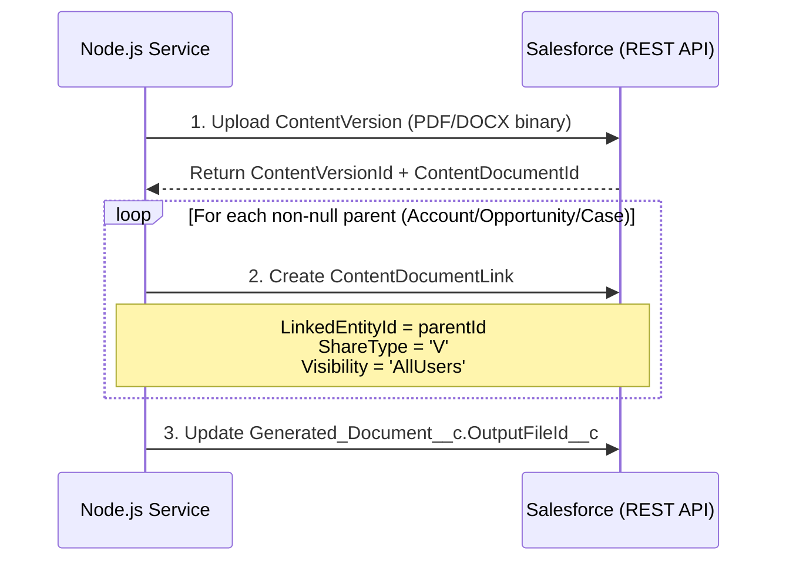

# ContentDocumentLink Strategy

## Overview

This document describes the strategy for linking generated PDF/DOCX documents to related Salesforce records, ensuring that generated files are discoverable from all relevant parent records (Account, Opportunity, Case).

## Background

In Salesforce, files are stored as `ContentVersion` records, which are versions of a `ContentDocument` (the logical file). To make a file visible from a specific record (like an Account or Opportunity), a `ContentDocumentLink` record must be created to establish the relationship.

## Strategy

### Linking to All Non-Null Parents

When a document is generated, the system creates `ContentDocumentLink` records for **all non-null parent records** specified in the generation request:

- **Account** (`AccountId`)
- **Opportunity** (`OpportunityId`)
- **Case** (`CaseId`)

This ensures that:
- Users can find the generated document from any related record's **Files** related list
- Documents are properly associated with all relevant business entities
- Audit trails are maintained across all related records

### ContentDocumentLink Settings

Each `ContentDocumentLink` is created with the following settings:

```apex
ContentDocumentLink link = new ContentDocumentLink();
link.LinkedEntityId = parentRecordId; // Account, Opportunity, or Case ID
link.ContentDocumentId = contentDocumentId; // From uploaded ContentVersion
link.ShareType = 'V'; // Viewer permission
link.Visibility = 'AllUsers'; // Visible to all users with access to the parent record
```

**Field explanations:**
- **`LinkedEntityId`**: The ID of the parent record (Account/Opportunity/Case)
- **`ContentDocumentId`**: The ID of the ContentDocument (obtained after uploading the ContentVersion)
- **`ShareType = 'V'`**: Grants **Viewer** permission (users can view but not edit the file)
- **`Visibility = 'AllUsers'`**: File is visible to all users who have access to the parent record (respects record-level security)

### Implementation Location

The linking logic is implemented in the **Node.js service** during the file upload phase:

1. **Upload ContentVersion** to Salesforce Files
2. **Retrieve ContentDocumentId** from the uploaded ContentVersion
3. **Create ContentDocumentLink records** for each non-null parent ID
4. **Update Generated_Document__c** record with `OutputFileId__c` (ContentVersionId)

### Data Flow



### Parent ID Extraction

Parent IDs are extracted by the **Apex DocgenEnvelopeService** when building the generation request:

```apex
public Map<String, Id> extractParents(Id recordId) {
    Map<String, Id> parents = new Map<String, Id>{
        'AccountId' => null,
        'OpportunityId' => null,
        'CaseId' => null
    };

    // Query record to extract parent relationships
    // Example: If recordId is an Opportunity, set OpportunityId and AccountId
    // ...

    return parents;
}
```

The envelope sent to Node.js includes these parent IDs:

```json
{
  "templateId": "...",
  "data": { ... },
  "parents": {
    "AccountId": "001xxxxxxxxxxxx",
    "OpportunityId": "006xxxxxxxxxxxx",
    "CaseId": null
  }
}
```

### Benefits

1. **Discoverability**: Users can find generated documents from any related record
2. **Audit Trail**: Documents are linked to all relevant business entities
3. **Security**: Respects Salesforce record-level security (`Visibility = 'AllUsers'`)
4. **Flexibility**: Supports multiple parent record types (Account, Opportunity, Case)
5. **Standard Salesforce UX**: Files appear in the standard Files related list on each record

### Examples

#### Example 1: Opportunity with Account

When generating a proposal for an Opportunity:
- `parents.OpportunityId` = "006..."
- `parents.AccountId` = "001..."
- `parents.CaseId` = null

**Result**: 2 `ContentDocumentLink` records created
- Link to Opportunity → Users see PDF on Opportunity's Files tab
- Link to Account → Users see PDF on Account's Files tab

#### Example 2: Case Only

When generating a case summary for a Case record:
- `parents.CaseId` = "500..."
- `parents.AccountId` = null (if Case is not linked to an Account)
- `parents.OpportunityId` = null

**Result**: 1 `ContentDocumentLink` record created
- Link to Case → Users see PDF on Case's Files tab

#### Example 3: Account with Multiple Opportunities

When generating an account summary from an Account record:
- `parents.AccountId` = "001..."
- `parents.OpportunityId` = null (not generated from a specific Opportunity)
- `parents.CaseId` = null

**Result**: 1 `ContentDocumentLink` record created
- Link to Account → Users see PDF on Account's Files tab

## Security Considerations

### Record-Level Security

By setting `Visibility = 'AllUsers'`, the file inherits the parent record's security:
- Users must have **Read** access to the parent record to see the file
- If a user loses access to the parent record, they also lose access to the file

### File Permissions

`ShareType = 'V'` (Viewer) ensures:
- Users can **view** and **download** the file
- Users **cannot edit** or **delete** the file (unless they have additional permissions)

### Multi-Parent Scenario

If a file is linked to multiple records (e.g., Account and Opportunity):
- A user with access to **either** parent record can see the file
- If a user has access to **both** parent records, they see the file in both Files lists

## Future Enhancements

Potential enhancements to the linking strategy:

1. **Custom Objects**: Support linking to custom objects (e.g., `Contract__c`, `Project__c`)
2. **Dynamic ShareType**: Allow admin configuration of `ShareType` (Viewer vs. Collaborator vs. Inferred)
3. **Conditional Linking**: Link to parents based on template configuration (e.g., only link to Account if `template.LinkToAccount__c = true`)
4. **Bulk Unlinking**: Add ability to remove stale links for regenerated documents

## References

- [Salesforce ContentVersion Documentation](https://developer.salesforce.com/docs/atlas.en-us.object_reference.meta/object_reference/sforce_api_objects_contentversion.htm)
- [Salesforce ContentDocumentLink Documentation](https://developer.salesforce.com/docs/atlas.en-us.object_reference.meta/object_reference/sforce_api_objects_contentdocumentlink.htm)
- [Files and Salesforce Files (Lightning Experience)](https://help.salesforce.com/s/articleView?id=sf.collab_files_overview.htm)

## Related Documentation

- [development-context.md](/development-context.md) - Overall system architecture
- [docs/idempotency.md](/docs/idempotency.md) - Idempotency and deduplication strategy
- [ADR 0004: Caching & Idempotency](/docs/adrs/0004-caching-idempotency.md) - Template caching and request hashing
