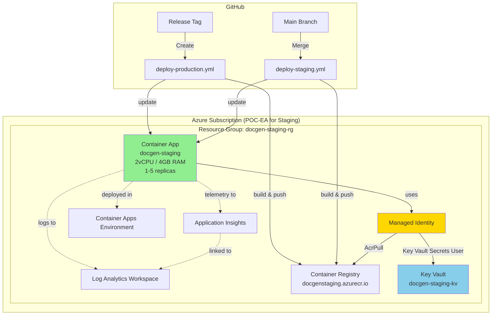

# Docgen Deployment Guide

This guide covers **day-to-day deployment operations** for the docgen application. For **one-time initial environment setup**, see [PROVISIONING.md](./PROVISIONING.md).

## Table of Contents

- [Overview](#overview)
- [Architecture](#architecture)
- [Prerequisites](#prerequisites)
- [Deployment Methods](#deployment-methods)
  - [Automated CI/CD (Recommended)](#automated-cicd-recommended)
  - [Manual Deployment](#manual-deployment)
  - [When to Use Each Method](#when-to-use-each-method)
- [Deploying to Staging](#deploying-to-staging)
- [Deploying to Production](#deploying-to-production)
- [Monitoring Deployments](#monitoring-deployments)
- [Rollback Procedures](#rollback-procedures)
- [Environment Management](#environment-management)
- [Health Checks & Validation](#health-checks--validation)
- [Common Deployment Issues](#common-deployment-issues)
- [Related Documentation](#related-documentation)

---

## Overview

The docgen application uses **Azure Container Apps** for hosting with fully automated CI/CD via **GitHub Actions**. The deployment pipeline handles:

- Docker image building and publishing to Azure Container Registry
- Infrastructure provisioning/updates via Bicep templates
- Secret management via Azure Key Vault
- Automated health checks and smoke tests
- Automatic rollback on failure

**Environments:**
- **Staging**: Automatic deployment on merge to `main` branch
- **Production**: Manual deployment on GitHub release (requires approval)

---

## Architecture

### Deployed Resources



### Resource Summary

| Resource | Staging | Production | Purpose |
|----------|---------|------------|---------|
| **Resource Group** | `docgen-staging-rg` | `docgen-production-rg` | Container for all resources |
| **Container Registry** | `docgenstaging` | `docgenproduction` | Docker image storage |
| **Key Vault** | `docgen-staging-kv` | `docgen-prod-kv` | Secrets management |
| **Container App** | `docgen-staging` | `docgen-production` | Application hosting |
| **App Insights** | `docgen-staging-insights` | `docgen-production-insights` | Telemetry & monitoring |
| **Log Analytics** | `docgen-staging-logs` | `docgen-production-logs` | Log aggregation |

### Application Configuration

- **Container Specs**: 2 vCPU, 4 GB RAM
- **Scaling**: 1-5 replicas (autoscale on CPU > 70%)
- **Region**: East US
- **Base Image**: Debian Bookworm Slim + LibreOffice 7.4
- **Health Probes**:
  - Startup: `/readyz` (30s timeout)
  - Liveness: `/healthz` (10s interval)
  - Readiness: `/readyz` (10s interval)

---

## Prerequisites

### For Automated CI/CD (All Deployments)
- ✅ GitHub repository access (push to `main` for staging, create releases for production)
- ✅ GitHub Actions enabled
- ✅ GitHub environments configured (`staging`, `production`)
- ✅ GitHub secrets configured (see [PROVISIONING.md](./PROVISIONING.md#github-cicd-setup))

### For Manual Deployment (Troubleshooting/Backup)
- ✅ Azure CLI installed ([Install Guide](https://docs.microsoft.com/cli/azure/install-azure-cli))
- ✅ Azure subscription access (Contributor role)
- ✅ Docker Desktop installed ([Install Guide](https://docs.docker.com/get-docker/))
- ✅ Bicep CLI installed (`az bicep install`)
- ✅ Git installed and repository cloned
- ✅ `.env` file with Salesforce credentials (for local testing)
- ✅ Private key file (`keys/server.key`)

### Access Requirements

**Azure Permissions:**
- `Contributor` role on resource group
- `Key Vault Secrets Officer` role on Key Vault (for manual secret updates)

**Salesforce Permissions:**
- Connected App configured with JWT Bearer Flow
- Integration User with appropriate permissions

---

## Deployment Methods

### Automated CI/CD (Recommended)

**Advantages:**
- ✅ Fully automated (build, deploy, test, rollback)
- ✅ Consistent and repeatable
- ✅ Built-in safety checks (health checks, smoke tests)
- ✅ Automatic rollback on failure
- ✅ Audit trail in GitHub Actions logs
- ✅ No local setup required

**Workflow:**
1. Code changes merged to `main` → Staging deployment
2. GitHub release created → Production deployment (with approval)

**Use for:**
- All routine deployments
- Hotfixes and features
- Infrastructure updates (Bicep changes)
- Dependency updates

---

### Manual Deployment

**Advantages:**
- ✅ Fine-grained control
- ✅ Useful for troubleshooting CI/CD issues
- ✅ Can deploy from any branch
- ✅ Bypasses GitHub Actions (if needed)

**Disadvantages:**
- ❌ More error-prone
- ❌ Requires local tools and Azure access
- ❌ Manual smoke testing required
- ❌ No automatic rollback

**Use for:**
- CI/CD pipeline troubleshooting
- Emergency deployments (if CI/CD is down)
- Testing infrastructure changes locally
- One-time environment setup ([PROVISIONING.md](./PROVISIONING.md))

---

### When to Use Each Method

| Scenario | Method | Rationale |
|----------|--------|-----------|
| **Routine feature deployment** | CI/CD | Automated, safe, traceable |
| **Hotfix deployment** | CI/CD | Fast, automated rollback |
| **Infrastructure update (Bicep)** | CI/CD | Validates changes, audit trail |
| **Dependency update** | CI/CD | Automated build and test |
| **CI/CD pipeline broken** | Manual | Bypass broken automation |
| **Testing Bicep changes locally** | Manual | Validate before committing |
| **Emergency deployment** | Manual (last resort) | If CI/CD unavailable |
| **Initial environment setup** | Manual | One-time provisioning |

---

## Deploying to Staging

### Method 1: Automated CI/CD (Recommended)

**Trigger**: Merge to `main` branch

**Steps:**

1. **Create feature branch and make changes:**
   ```bash
   git checkout -b feature/my-feature
   # Make code changes
   git add .
   git commit -m "feat: add new feature"
   git push origin feature/my-feature
   ```

2. **Create Pull Request:**
   ```bash
   gh pr create --title "Add new feature" --body "Description of changes"
   ```

3. **Wait for CI checks to pass:**
   - Node.js tests (322 tests)
   - Salesforce Apex tests (46 tests)
   - Linting and TypeScript compilation
   - Dockerfile validation

4. **Merge to main:**
   ```bash
   gh pr merge <PR-number> --squash
   # OR merge via GitHub UI
   ```

5. **Monitor deployment:**
   ```bash
   # Watch workflow progress
   gh workflow view deploy-staging.yml
   gh run list --workflow=deploy-staging.yml
   gh run watch <run-id>
   ```

6. **Verify deployment:**
   ```bash
   # Check app health
   curl https://docgen-staging.greenocean-24bbbaf2.eastus.azurecontainerapps.io/healthz
   curl https://docgen-staging.greenocean-24bbbaf2.eastus.azurecontainerapps.io/readyz
   ```

**Automated workflow jobs:**
1. ✅ **build-image**: Build Docker image, push to ACR with `sha-<git-sha>` tag
2. ✅ **deploy-infrastructure**: Deploy/update Bicep templates (idempotent)
3. ✅ **populate-secrets**: Update Key Vault secrets from GitHub
4. ✅ **update-app**: Update Container App, wait for new revision
5. ✅ **smoke-tests**: Health check + document generation test
6. ✅ **rollback**: Auto-rollback if any job fails
7. ✅ **summary**: Post deployment summary as commit comment

**Expected duration**: 8-12 minutes

**Success criteria:**
- ✅ All workflow jobs complete successfully
- ✅ Health check returns 200
- ✅ Readiness check returns `{"ready":true,"checks":{"jwks":true,"salesforce":true,"keyVault":true}}`
- ✅ Smoke test generates PDF successfully
- ✅ New revision active in Container App

---

### Method 2: Manual Deployment

**Use only if CI/CD is unavailable**

1. **Login to Azure:**
   ```bash
   az login
   az account set --subscription "POC-EA"
   az account show
   ```

2. **Set environment variables:**
   ```bash
   export ENVIRONMENT="staging"
   export RESOURCE_GROUP="docgen-staging-rg"
   export ACR_NAME="docgenstaging"
   export KEY_VAULT_NAME="docgen-staging-kv"
   export APP_NAME="docgen-staging"
   export LOCATION="eastus"
   ```

3. **Build and push Docker image:**
   ```bash
   # Login to ACR
   az acr login --name "$ACR_NAME"

   # Build for linux/amd64 (important for Azure Container Apps!)
   docker build --platform linux/amd64 \
     -t "$ACR_NAME.azurecr.io/docgen-api:$(git rev-parse --short HEAD)" \
     -t "$ACR_NAME.azurecr.io/docgen-api:latest" \
     .

   # Push images
   docker push "$ACR_NAME.azurecr.io/docgen-api:$(git rev-parse --short HEAD)"
   docker push "$ACR_NAME.azurecr.io/docgen-api:latest"

   # Verify in ACR
   az acr repository show-tags --name "$ACR_NAME" --repository docgen-api
   ```

4. **Deploy infrastructure (if Bicep changes):**
   ```bash
   az deployment group create \
     --name "manual-deploy-$(date +%Y%m%d-%H%M%S)" \
     --resource-group "$RESOURCE_GROUP" \
     --template-file infra/main.bicep \
     --parameters infra/parameters/staging.bicepparam

   # Wait for completion (~10-15 minutes on first deploy, ~2-3 minutes for updates)
   ```

5. **Update Key Vault secrets (if needed):**
   ```bash
   # Load from .env
   source .env

   # Update secrets
   az keyvault secret set --vault-name "$KEY_VAULT_NAME" --name SF-PRIVATE-KEY --file keys/server.key
   az keyvault secret set --vault-name "$KEY_VAULT_NAME" --name SF-CLIENT-ID --value "$SF_CLIENT_ID"
   az keyvault secret set --vault-name "$KEY_VAULT_NAME" --name SF-USERNAME --value "$SF_USERNAME"
   az keyvault secret set --vault-name "$KEY_VAULT_NAME" --name SF-DOMAIN --value "$SF_DOMAIN"
   ```

6. **Update Container App with new image:**
   ```bash
   # Get image digest
   IMAGE_TAG=$(git rev-parse --short HEAD)

   # Update Container App
   az containerapp update \
     --name "$APP_NAME" \
     --resource-group "$RESOURCE_GROUP" \
     --image "$ACR_NAME.azurecr.io/docgen-api:$IMAGE_TAG"

   # Wait for revision activation
   az containerapp revision list \
     --name "$APP_NAME" \
     --resource-group "$RESOURCE_GROUP" \
     --query "[].{name:name, active:properties.active, createdTime:properties.createdTime}" \
     -o table
   ```

7. **Verify deployment:**
   ```bash
   # Get app URL
   APP_FQDN=$(az containerapp show \
     --name "$APP_NAME" \
     --resource-group "$RESOURCE_GROUP" \
     --query properties.configuration.ingress.fqdn -o tsv)

   echo "App URL: https://$APP_FQDN"

   # Test endpoints
   curl https://$APP_FQDN/healthz
   curl https://$APP_FQDN/readyz

   # View logs
   az containerapp logs show \
     --name "$APP_NAME" \
     --resource-group "$RESOURCE_GROUP" \
     --tail 50 \
     --follow
   ```

---

## Deploying to Production

### Method 1: Automated CI/CD (Recommended)

**Trigger**: Create GitHub release

**Steps:**

1. **Ensure staging is stable:**
   - Verify staging deployment successful
   - Run integration tests in staging
   - Check Application Insights for errors
   - Verify no critical alerts

2. **Create GitHub release:**
   ```bash
   # Tag and release
   git checkout main
   git pull
   git tag -a v1.0.0 -m "Release v1.0.0: Initial production release"
   git push origin v1.0.0

   # Create release via CLI
   gh release create v1.0.0 \
     --title "Release v1.0.0" \
     --notes "## Changes
   - Feature 1
   - Feature 2
   - Bug fix 3

   ## Deployment
   - Staging validated: [link]
   - Tests passed: 322/322
   - Breaking changes: None"

   # OR create via GitHub UI
   ```

3. **Approve deployment:**
   - GitHub Actions will trigger `deploy-production.yml`
   - Workflow **requires manual approval** (production environment protection)
   - Review deployment details in GitHub Actions UI
   - Click "Review deployments" → "Approve and deploy"

4. **Monitor deployment:**
   ```bash
   gh run list --workflow=deploy-production.yml
   gh run watch <run-id>
   ```

5. **Verify deployment:**
   ```bash
   # Check production app health
   curl https://docgen-production.<region>.azurecontainerapps.io/healthz
   curl https://docgen-production.<region>.azurecontainerapps.io/readyz
   ```

**Automated workflow jobs:**
1. ✅ **build-image**: Build Docker image with `v1.0.0` and `sha-<git-sha>` tags
2. ✅ **deploy-infrastructure**: Deploy/update production Bicep templates
3. ✅ **populate-secrets**: Update production Key Vault secrets
4. ✅ **update-app**: Update production Container App
5. ✅ **smoke-tests**: Extended smoke tests (5 document generation iterations + worker endpoints)
6. ✅ **rollback**: Auto-rollback if any job fails
7. ✅ **summary**: Post deployment summary to release notes

**Expected duration**: 10-15 minutes (including approval wait time)

**Success criteria:**
- ✅ Manual approval granted
- ✅ All workflow jobs complete successfully
- ✅ Extended smoke tests pass (5 iterations)
- ✅ Health and readiness checks pass
- ✅ Worker endpoints responding
- ✅ Application Insights shows no errors
- ✅ New revision active in production

---

### Method 2: Manual Deployment to Production

**⚠️ Use with extreme caution - production environment**

Same steps as manual staging deployment, but:

1. **Set production environment variables:**
   ```bash
   export ENVIRONMENT="production"
   export RESOURCE_GROUP="docgen-production-rg"
   export ACR_NAME="docgenproduction"
   export KEY_VAULT_NAME="docgen-prod-kv"
   export APP_NAME="docgen-production"
   ```

2. **Use production parameter file:**
   ```bash
   --parameters infra/parameters/production.bicepparam
   ```

3. **Perform additional validation:**
   - Run extended smoke tests manually
   - Verify worker endpoints
   - Check Application Insights dashboards
   - Notify team before/after deployment

4. **Create git tag for traceability:**
   ```bash
   git tag -a manual-prod-$(date +%Y%m%d-%H%M) -m "Manual production deployment"
   git push --tags
   ```

---

## Monitoring Deployments

### GitHub Actions UI

1. **Navigate to Actions tab**: https://github.com/<owner>/docgen/actions
2. **Select workflow**: `deploy-staging.yml` or `deploy-production.yml`
3. **View run details**: Click on latest run
4. **Monitor job progress**: Real-time logs for each job
5. **Check deployment summary**: Posted as commit comment

### Azure Portal

1. **Navigate to Container App**: https://portal.azure.com
2. **Resource Groups** → `docgen-staging-rg` → `docgen-staging`
3. **Revisions and replicas**:
   - View active revisions
   - Check traffic distribution
   - Monitor replica count
4. **Logs**: View container logs in real-time
5. **Metrics**: CPU, memory, request rate

### Azure CLI

```bash
# View active revisions
az containerapp revision list \
  --name docgen-staging \
  --resource-group docgen-staging-rg \
  --query "[].{name:name, active:properties.active, traffic:properties.trafficWeight, created:properties.createdTime}" \
  -o table

# View container logs
az containerapp logs show \
  --name docgen-staging \
  --resource-group docgen-staging-rg \
  --tail 100 \
  --follow

# View replica status
az containerapp replica list \
  --name docgen-staging \
  --resource-group docgen-staging-rg \
  --revision <revision-name>
```

### Application Insights

1. **Live Metrics**: Real-time request rate, failures, response time
2. **Failures**: Exception tracking
3. **Performance**: Duration trends
4. **Custom Metrics**: `docgen_duration_ms`, `queue_depth`, etc.

See [dashboards.md](./dashboards.md) for complete monitoring guide.

---

## Rollback Procedures

### Automated Rollback (CI/CD)

**Automatic rollback triggers:**
- Any job failure after deployment
- Health check failure
- Smoke test failure

**Rollback process (automatic):**
1. Identify previous active revision
2. Deactivate failed revision
3. Activate previous revision
4. Verify health checks pass
5. Post rollback notification

**No action required** - GitHub Actions handles automatically.

### Manual Rollback

**When to use:**
- CI/CD rollback failed
- Issue discovered after deployment
- Need to roll back to specific revision (not latest)

**Steps:**

1. **List available revisions:**
   ```bash
   az containerapp revision list \
     --name docgen-staging \
     --resource-group docgen-staging-rg \
     --query "[].{name:name, active:properties.active, created:properties.createdTime, traffic:properties.trafficWeight}" \
     -o table
   ```

2. **Identify target revision:**
   - Look for previously active revision with `traffic: 100`
   - Note the revision name (e.g., `docgen-staging--abc123`)

3. **Deactivate current (failed) revision:**
   ```bash
   FAILED_REVISION="docgen-staging--xyz789"  # Replace with actual

   az containerapp revision deactivate \
     --name docgen-staging \
     --resource-group docgen-staging-rg \
     --revision "$FAILED_REVISION"
   ```

4. **Activate previous (good) revision:**
   ```bash
   PREVIOUS_REVISION="docgen-staging--abc123"  # Replace with actual

   az containerapp revision activate \
     --name docgen-staging \
     --resource-group docgen-staging-rg \
     --revision "$PREVIOUS_REVISION"
   ```

5. **Verify rollback:**
   ```bash
   # Check health
   curl https://docgen-staging.greenocean-24bbbaf2.eastus.azurecontainerapps.io/healthz
   curl https://docgen-staging.greenocean-24bbbaf2.eastus.azurecontainerapps.io/readyz

   # Verify revision
   az containerapp revision list \
     --name docgen-staging \
     --resource-group docgen-staging-rg \
     --query "[?properties.active].{name:name, traffic:properties.trafficWeight}"
   ```

6. **Monitor logs for errors:**
   ```bash
   az containerapp logs show \
     --name docgen-staging \
     --resource-group docgen-staging-rg \
     --tail 100 \
     --follow
   ```

7. **Investigate root cause:**
   - Review failed revision logs
   - Check Application Insights for exceptions
   - Review deployment changes (code diff, Bicep diff)
   - Document in post-mortem

**Expected rollback duration**: 2-5 minutes

See [RUNBOOKS.md](./RUNBOOKS.md#rollback-procedure) for detailed rollback runbook.

---

## Environment Management

### Staging vs Production

| Aspect | Staging | Production |
|--------|---------|------------|
| **Subscription** | POC-EA | TBD (future) |
| **Deployment** | Automatic (merge to main) | Manual (GitHub release + approval) |
| **Data** | Salesforce sandbox/scratch org | Salesforce production org |
| **Secrets** | GitHub staging environment | GitHub production environment |
| **Smoke Tests** | 1 document generation | 5 document generations + worker tests |
| **Monitoring** | Basic alerts | Full alert suite |
| **Cost** | ~$80-150/month | ~$100-200/month (higher scale) |
| **Purpose** | Testing, validation, demos | Live user traffic |

### Secret Rotation

**Salesforce JWT Private Key:**

1. **Generate new key pair:**
   ```bash
   openssl genrsa -out keys/server-new.key 4096
   openssl rsa -pubout -in keys/server-new.key -out keys/server-new.pub
   ```

2. **Update Salesforce Connected App:**
   - Navigate to Setup → App Manager → Docgen API → Manage
   - Edit → Digital Certificate → Upload `server-new.pub`
   - Save

3. **Update GitHub secret:**
   ```bash
   gh secret set SF_PRIVATE_KEY --env staging < keys/server-new.key
   gh secret set SF_PRIVATE_KEY --env production < keys/server-new.key
   ```

4. **Deploy to update Key Vault:**
   - Staging: Merge any commit to `main`
   - Production: Create new release

5. **Verify connectivity:**
   ```bash
   curl https://docgen-staging.../readyz
   # Should show: "salesforce": true
   ```

6. **Remove old key:**
   ```bash
   rm keys/server.key keys/server.pub
   mv keys/server-new.key keys/server.key
   mv keys/server-new.pub keys/server.pub
   git add keys/ && git commit -m "chore: rotate Salesforce JWT key"
   ```

**Azure Service Principal Client Secret:**

1. **Generate new secret in Azure AD:**
   ```bash
   az ad sp credential reset \
     --id <service-principal-id> \
     --append \
     --query password -o tsv
   ```

2. **Update AZURE_CREDENTIALS JSON:**
   - Copy JSON from original setup
   - Replace `clientSecret` value with new secret
   - Keep other fields unchanged

3. **Update GitHub secret:**
   ```bash
   echo '<new-json>' | gh secret set AZURE_CREDENTIALS --env staging
   echo '<new-json>' | gh secret set AZURE_CREDENTIALS --env production
   ```

4. **Test deployment:**
   - Create test deployment to staging
   - Verify Azure login succeeds in GitHub Actions

5. **Remove old secret (after verification):**
   ```bash
   az ad sp credential delete \
     --id <service-principal-id> \
     --key-id <old-key-id>
   ```

### Configuration Updates

**Update environment variables (non-secret):**

1. **Edit Bicep parameter file:**
   ```bash
   # For staging
   vi infra/parameters/staging.bicepparam

   # For production
   vi infra/parameters/production.bicepparam
   ```

2. **Commit and deploy:**
   ```bash
   git add infra/parameters/
   git commit -m "chore: update environment variables"
   git push
   ```

3. **Deploy via CI/CD** (Bicep deployment is idempotent)

**Update Key Vault secrets:**

Option 1: Via GitHub Actions (recommended):
1. Update GitHub secret
2. Trigger deployment (populates Key Vault from GitHub secrets)

Option 2: Manual update (for emergencies):
```bash
az keyvault secret set \
  --vault-name docgen-staging-kv \
  --name SF-CLIENT-ID \
  --value "new-value"

# Restart Container App to pick up new value
az containerapp revision restart \
  --name docgen-staging \
  --resource-group docgen-staging-rg \
  --revision <active-revision-name>
```

---

## Health Checks & Validation

### Health Endpoint (`/healthz`)

**Purpose**: Liveness probe (is the process running?)

**Expected response:**
```json
{"status":"ok"}
```

**HTTP Status**: 200

**Failure action**: Container restart

### Readiness Endpoint (`/readyz`)

**Purpose**: Readiness probe (is the app ready to serve traffic?)

**Expected response:**
```json
{
  "ready": true,
  "checks": {
    "jwks": true,
    "salesforce": true,
    "keyVault": true
  }
}
```

**HTTP Status**: 200 (ready) or 503 (not ready)

**Checks performed:**
- `jwks`: Azure AD JWKS endpoint reachable
- `salesforce`: Salesforce authentication successful
- `keyVault`: Key Vault accessible and secrets loaded

**Failure action**: Traffic stopped to replica

### Smoke Test Validation

**Staging smoke test:**
1. Health check: `GET /healthz` → 200
2. Readiness check: `GET /readyz` → 200
3. Document generation: `POST /generate` → 200 or 401 (AAD auth required)

**Production smoke test:**
1. All staging tests
2. Extended document generation: 5 iterations
3. Worker status: `GET /worker/status` → 200 or 401
4. Worker stats: `GET /worker/stats` → 200 or 401

**Test files location**: `.github/workflows/deploy-*.yml`

---

## Common Deployment Issues

### Issue: Docker Build Fails

**Symptoms:**
- GitHub Actions job `build-image` fails
- Error: "failed to solve" or "executor failed running"

**Diagnosis:**
```bash
# Build locally to reproduce
docker build --platform linux/amd64 -t docgen-api:test .

# Check Docker build logs
```

**Common causes:**
1. **Syntax error in Dockerfile**: Fix syntax, commit, push
2. **Missing dependency**: Add to `package.json`, commit, push
3. **LibreOffice installation failed**: Check Debian repository availability
4. **Out of disk space**: Clean Docker cache locally, retry in CI

**Resolution:**
- Fix issue locally first
- Verify build succeeds: `docker build --platform linux/amd64 .`
- Push fix to trigger new workflow run

---

### Issue: Bicep Deployment Fails

**Symptoms:**
- Job `deploy-infrastructure` fails
- Error: "ValidationFailed" or "ResourceNotFound"

**Diagnosis:**
```bash
# Validate Bicep locally
az bicep build --file infra/main.bicep

# Run what-if analysis
az deployment group what-if \
  --resource-group docgen-staging-rg \
  --template-file infra/main.bicep \
  --parameters infra/parameters/staging.bicepparam
```

**Common causes:**
1. **Invalid Bicep syntax**: Linting errors
2. **Resource name conflict**: Resource already exists with different config
3. **Permission denied**: Service Principal lacks permissions
4. **API version mismatch**: Azure API deprecated

**Resolution:**
- Review Bicep validation errors
- Fix syntax or parameter issues
- For resource conflicts: Delete resource or rename in Bicep
- Retry deployment

---

### Issue: Container Won't Start

**Symptoms:**
- Job `update-app` succeeds but health checks fail
- Revision shows "ProvisioningFailed"
- Container logs show errors

**Diagnosis:**
```bash
# Check revision status
az containerapp revision list \
  --name docgen-staging \
  --resource-group docgen-staging-rg

# View container logs
az containerapp logs show \
  --name docgen-staging \
  --resource-group docgen-staging-rg \
  --tail 100
```

**Common causes:**
1. **Missing Key Vault secrets**: App fails to start without required secrets
2. **Incorrect RBAC roles**: Managed Identity can't access Key Vault or ACR
3. **Platform mismatch**: Image built for wrong platform (must be `linux/amd64`)
4. **Application error**: Code crashes on startup

**Resolution:**

Missing secrets:
```bash
# Verify secrets exist
az keyvault secret list --vault-name docgen-staging-kv --query "[].name"

# Populate missing secrets
az keyvault secret set --vault-name docgen-staging-kv --name SF-PRIVATE-KEY --file keys/server.key
```

RBAC issues:
```bash
# Get Managed Identity principal ID
PRINCIPAL_ID=$(az containerapp show \
  --name docgen-staging \
  --resource-group docgen-staging-rg \
  --query identity.principalId -o tsv)

# Assign Key Vault Secrets User role
az role assignment create \
  --role "Key Vault Secrets User" \
  --assignee "$PRINCIPAL_ID" \
  --scope "/subscriptions/<sub-id>/resourceGroups/docgen-staging-rg/providers/Microsoft.KeyVault/vaults/docgen-staging-kv"

# Assign AcrPull role
az role assignment create \
  --role "AcrPull" \
  --assignee "$PRINCIPAL_ID" \
  --scope "/subscriptions/<sub-id>/resourceGroups/docgen-staging-rg/providers/Microsoft.ContainerRegistry/registries/docgenstaging"

# Wait 60 seconds for role propagation
sleep 60

# Restart app
az containerapp revision restart \
  --name docgen-staging \
  --resource-group docgen-staging-rg \
  --revision <revision-name>
```

Platform mismatch:
```bash
# Rebuild with correct platform
docker build --platform linux/amd64 -t docgenstaging.azurecr.io/docgen-api:latest .
docker push docgenstaging.azurecr.io/docgen-api:latest
```

---

### Issue: Smoke Tests Fail

**Symptoms:**
- Job `smoke-tests` fails
- Health check or document generation returns errors

**Diagnosis:**
- Review GitHub Actions logs for specific test failure
- Check Container App logs
- Test endpoints manually

**Common causes:**
1. **App not fully started**: Startup probe timeout too short
2. **Salesforce authentication failed**: Invalid credentials
3. **Key Vault inaccessible**: Secrets not loaded
4. **AAD authentication required**: Expected 401 response

**Resolution:**

App startup:
- Increase startup probe timeout in Bicep (currently 30s)
- Check for slow dependencies (Key Vault, Salesforce)

Salesforce auth:
```bash
# Verify SF credentials in Key Vault
az keyvault secret show --vault-name docgen-staging-kv --name SF-USERNAME
az keyvault secret show --vault-name docgen-staging-kv --name SF-CLIENT-ID

# Test SF auth manually
curl -X GET https://docgen-staging.../readyz
# Should show: "salesforce": true
```

Expected 401:
- Smoke tests accept both 200 (success) and 401 (AAD auth required)
- If `/generate` returns 401, this is expected (AAD token required)
- Test manually with AAD token for full validation

---

### Issue: Rollback Fails

**Symptoms:**
- Job `rollback` fails
- Previous revision not found or can't activate

**Diagnosis:**
```bash
# List all revisions (including inactive)
az containerapp revision list \
  --name docgen-staging \
  --resource-group docgen-staging-rg \
  --all

# Check revision status
az containerapp revision show \
  --name docgen-staging \
  --resource-group docgen-staging-rg \
  --revision <revision-name>
```

**Common causes:**
1. **No previous revision**: First deployment (nothing to roll back to)
2. **Previous revision deleted**: Retention policy removed old revisions
3. **Multiple failed deployments**: Chain of failures, no good revision

**Resolution:**

Manual rollback:
```bash
# Find oldest working revision
az containerapp revision list \
  --name docgen-staging \
  --resource-group docgen-staging-rg \
  --query "[?properties.provisioningState=='Succeeded'].{name:name, created:properties.createdTime}" \
  -o table

# Activate known-good revision
az containerapp revision activate \
  --name docgen-staging \
  --resource-group docgen-staging-rg \
  --revision <good-revision-name>
```

No working revision available:
- Perform manual deployment from last known good commit
- Consider redeploying from scratch using provisioning script

See [TROUBLESHOOTING-INDEX.md](./TROUBLESHOOTING-INDEX.md) for more issues.

---

## Related Documentation

### Primary Documentation
- **[PROVISIONING.md](./PROVISIONING.md)** - One-time environment setup (manual provisioning steps)
- **[dashboards.md](./dashboards.md)** - Monitoring, alerts, and operational runbooks (6 runbooks)
- **[RUNBOOKS.md](./RUNBOOKS.md)** - Operational procedures (rollback, scaling, key rotation, disaster recovery)
- **[TROUBLESHOOTING-INDEX.md](./TROUBLESHOOTING-INDEX.md)** - Consolidated troubleshooting index

### Feature Documentation
- **[README.md](../README.md)** - Application overview and features
- **[template-authoring.md](./template-authoring.md)** - Template authoring guide (docx-templates usage)
- **[idempotency.md](./idempotency.md)** - Idempotency strategy (RequestHash)
- **[contentdocumentlink.md](./contentdocumentlink.md)** - ContentDocumentLink strategy (file linking)

### Infrastructure
- **[infra/](../infra/)** - Bicep templates (main.bicep + 5 modules)
- **[.github/workflows/](../.github/workflows/)** - GitHub Actions workflows (CI/CD)

### External Resources
- [Azure Container Apps Documentation](https://learn.microsoft.com/azure/container-apps/)
- [Azure Bicep Documentation](https://learn.microsoft.com/azure/azure-resource-manager/bicep/)
- [GitHub Actions Documentation](https://docs.github.com/actions)
- [Docker Multi-platform Builds](https://docs.docker.com/build/building/multi-platform/)

---

## Support

For deployment issues:
1. Check [TROUBLESHOOTING-INDEX.md](./TROUBLESHOOTING-INDEX.md)
2. Review container logs: `az containerapp logs show --name docgen-staging --resource-group docgen-staging-rg --follow`
3. Check Application Insights: [dashboards.md](./dashboards.md)
4. Review GitHub Actions workflow logs
5. Consult operational runbooks: [RUNBOOKS.md](./RUNBOOKS.md)

For infrastructure issues:
- Review Bicep validation errors
- Check Azure Policy compliance
- Verify Service Principal permissions
- See [PROVISIONING.md](./PROVISIONING.md) troubleshooting section

For monitoring and alerts:
- See [dashboards.md](./dashboards.md) for complete monitoring guide
- Review runbooks for incident response procedures

---

**Last Updated**: 2025-11-11
**Version**: 1.0
**Maintainer**: Docgen Team
