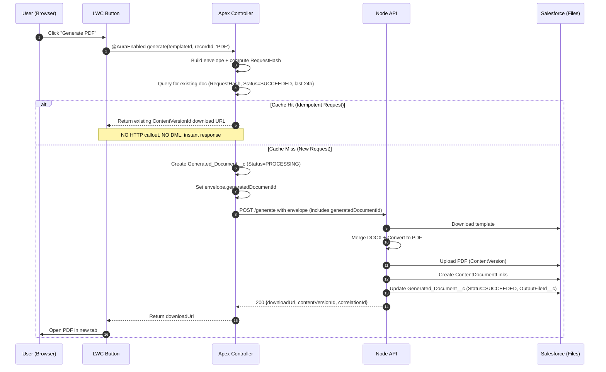

# Idempotency Strategy

This document describes how the Salesforce PDF Generation system implements idempotency to prevent duplicate document generation for identical requests.

---

## Overview

**Idempotency** ensures that making the same request multiple times produces the same result without unwanted side effects (e.g., generating the same document twice). This is critical for:

- **User error prevention**: Protect against double-clicks or accidental retries
- **Network reliability**: Handle transient failures and retries safely
- **Cost optimization**: Avoid wasteful regeneration of identical documents
- **Audit consistency**: Maintain a single source of truth for each unique request

---

## How It Works

### 1. Request Hash Computation (Apex)

Apex is responsible for computing a **deterministic hash** that uniquely identifies a request. This hash is used as an **External ID** on the `Generated_Document__c` object.

#### Hash Formula

```
RequestHash = sha256(templateId | outputFormat | sha256(canonical_json(data)))
```

Where:
- `templateId`: Salesforce ContentVersionId of the template (18 chars)
- `outputFormat`: `PDF` or `DOCX`
- `data`: The complete data envelope (Account, Opportunity, LineItems, etc.)

#### Implementation

See `DocgenEnvelopeService.computeHash()`:

```apex
public static String computeHash(String templateId, String outputFormat, String dataJson) {
    // Create deterministic input string
    String input = templateId + '|' + outputFormat + '|' + dataJson;

    // Generate SHA-256 hash
    Blob hash = Crypto.generateDigest('SHA-256', Blob.valueOf(input));

    // Convert to hex and prepend prefix
    return 'sha256:' + EncodingUtil.convertToHex(hash);
}
```

**Example Output:**
```
sha256:a1b2c3d4e5f6g7h8i9j0k1l2m3n4o5p6q7r8s9t0u1v2w3x4y5z6a7b8c9d0e1f2
```

---

### 2. Apex-Side Idempotency Check (Pre-Callout)

Before making an HTTP callout to the Node API, the Apex `DocgenController` checks if a document with the same `RequestHash__c` has already been successfully generated **within the last 24 hours**.

#### Why 24 Hours?

- **Performance**: Limits query scope to recent documents
- **Flexibility**: Allows re-generation if business data changes over time
- **Balance**: Prevents immediate duplicates while not caching forever

#### Implementation

See `DocgenController.checkExistingDocument()`:

```apex
private static Generated_Document__c checkExistingDocument(String requestHash) {
    List<Generated_Document__c> existing = [
        SELECT Id, OutputFileId__c, Status__c, CreatedDate, CorrelationId__c
        FROM Generated_Document__c
        WHERE RequestHash__c = :requestHash
        AND Status__c = 'SUCCEEDED'
        AND CreatedDate = LAST_N_DAYS:1  // 24-hour cache window
        ORDER BY CreatedDate DESC
        LIMIT 1
    ];
    return existing.isEmpty() ? null : existing[0];
}
```

#### Behavior

- **Cache Hit**: Return existing `ContentVersionId` download URL immediately (no callout, no DML)
- **Cache Miss**: Proceed with document generation

---

### 3. Node-Side Responsibility (T-12)

#### Current Design Decision

**Node does NOT implement its own idempotency check.**

Per the T-12 design decisions:
- **Apex handles idempotency** via pre-callout check
- **Node relies on Apex** to prevent duplicate requests
- This simplifies Node implementation and avoids redundant queries

#### Why Not Implement Node-Side Idempotency?

| Consideration | Reasoning |
|--------------|-----------|
| **Separation of concerns** | Apex owns the request orchestration and caching strategy |
| **Performance** | Avoids an extra Salesforce query from Node |
| **Consistency** | Single source of truth (Apex) for cache policy |
| **Simplicity** | Node focuses on generation, not request deduplication |

#### Future Batch Flows

For **batch generation** (T-14), the Node poller will process `Generated_Document__c` records directly. Idempotency will still be enforced via:
- **Unique External ID constraint** on `RequestHash__c` (prevents duplicate inserts)
- **Status-based locking** (LockedUntil__c field prevents concurrent processing)

---

## Data Model

### Generated_Document__c Fields

| Field | Type | Purpose |
|-------|------|---------|
| `RequestHash__c` | Text(80), **External ID, Unique** | Idempotency key |
| `Status__c` | Picklist | QUEUED, PROCESSING, SUCCEEDED, FAILED, CANCELED |
| `OutputFileId__c` | Text(18) | ContentVersionId of generated PDF |
| `MergedDocxFileId__c` | Text(18) | ContentVersionId of merged DOCX (if stored) |
| `RequestJSON__c` | Long Text Area | Full request envelope (for audit/replay) |
| `Attempts__c` | Number | Retry counter (for batch flows) |
| `LockedUntil__c` | Datetime | Pessimistic lock for poller (prevents double-processing) |
| `CreatedDate` | Datetime | Timestamp for cache window queries |
| `CorrelationId__c` | Text(36) | UUIDv4 for tracing |

---

## Request Flow Diagram



---

## Key Implementation Points

### 1. Hash Stability

The hash **must be deterministic** across runs:
- JSON serialization **must be canonical** (consistent key ordering)
- Apex `JSON.serialize()` provides this guarantee
- Avoid including volatile fields (timestamps, user IDs) in the data envelope

### 2. External ID Constraint

The `RequestHash__c` field has:
- **Unique** constraint (enforced by Salesforce)
- **External ID** flag (indexed for fast lookups)

This prevents accidental duplicate inserts even if the Apex check is bypassed.

### 3. Race Conditions

**Scenario**: Two users click "Generate" simultaneously for the same data.

**Protection**:
1. Apex idempotency check runs in parallel for both requests
2. Both might miss the cache (no existing document yet)
3. Both create `Generated_Document__c` records
4. **Salesforce enforces unique constraint** on `RequestHash__c`
5. One insert succeeds, the other fails with `DUPLICATE_VALUE` error
6. The failed request can retry and hit the cache

**Result**: Only one document is generated; both users eventually get the same file.

---

## Cache Expiry Strategy

### Current: 24-Hour Sliding Window

```apex
AND CreatedDate = LAST_N_DAYS:1
```

**Pros**:
- Simple to implement and understand
- Prevents immediate duplicates (most common case)
- Allows re-generation if data changes overnight

**Cons**:
- Documents are regenerated even if data hasn't changed after 24 hours
- No awareness of actual data changes

### Future Enhancement: Data Change Detection

Instead of time-based expiry, detect if the **source data** has changed:

```apex
// Pseudo-code for future enhancement
if (existing document found) {
    if (currentDataHash == existing.DataHash__c) {
        // Data unchanged - reuse document
        return existingDoc;
    } else {
        // Data changed - regenerate
        proceed with generation;
    }
}
```

This would require adding a `DataHash__c` field to track the content hash separately from the full request hash.

---

## Testing Idempotency

### Apex Tests

See `DocgenControllerTest.testIdempotency()`:

```apex
@isTest
static void testIdempotency() {
    // Create template and account
    Docgen_Template__c template = createTestTemplate();
    Account acc = createTestAccount();

    // First request - generates document
    String firstUrl = DocgenController.generate(template.Id, acc.Id, 'PDF');

    // Verify Generated_Document__c was created
    List<Generated_Document__c> docs = [SELECT Id, RequestHash__c, Status__c FROM Generated_Document__c];
    System.assertEquals(1, docs.size());

    // Second request with SAME data - should hit cache
    String secondUrl = DocgenController.generate(template.Id, acc.Id, 'PDF');

    // Verify NO new document was created
    docs = [SELECT Id FROM Generated_Document__c];
    System.assertEquals(1, docs.size(), 'Idempotency check should prevent duplicate');

    // Verify same download URL returned
    System.assertEquals(firstUrl, secondUrl);
}
```

### Node Tests

See `test/sf.files.test.ts`:

```typescript
it('should upload PDF, create links, and update Generated_Document__c', async () => {
    const mockRequest: DocgenRequest = {
        // ... full request payload
        generatedDocumentId: 'a00xx000000gdocXXX',  // Passed from Apex
    };

    // Mock Salesforce API calls
    nock('https://test.salesforce.com')
        .patch(`/services/data/v59.0/sobjects/Generated_Document__c/${mockRequest.generatedDocumentId}`)
        .reply(204);

    // Call upload function
    const result = await uploadAndLinkFiles(pdfBuffer, null, mockRequest, api);

    // Verify update was called with SUCCESS status
    expect(result.pdfContentVersionId).toBeTruthy();
});
```

---

## Observability

### Metrics to Monitor

| Metric | Description | Alert Threshold |
|--------|-------------|----------------|
| `idempotency_cache_hit_rate` | % of requests served from cache | < 30% (investigate if low) |
| `duplicate_hash_errors` | Number of unique constraint violations | > 10/hour (race conditions) |
| `cache_hit_latency_ms` | Time to serve cached response | > 100ms (query performance issue) |

### Logging

All idempotency events are logged with correlation IDs:

```apex
System.debug('Idempotency cache hit: RequestHash=' + requestHash + ', CorrelationId=' + correlationId);
```

```typescript
logger.info(
    { requestHash, existingDocId, correlationId },
    'Idempotency check: cache hit'
);
```

---

## Troubleshooting

### Problem: Users report documents not regenerating after data changes

**Diagnosis**: Check if the request is within the 24-hour cache window.

**Solution**:
- Manually delete the `Generated_Document__c` record to force regeneration
- Wait 24 hours for cache to expire naturally
- (Future) Implement data change detection

---

### Problem: DUPLICATE_VALUE errors in logs

**Diagnosis**: Race condition where two simultaneous requests create documents with the same `RequestHash__c`.

**Expected Behavior**: This is normal and self-correcting. One request succeeds, the other retries and hits the cache.

**Action**: Monitor frequency. If > 10/hour, investigate:
- Is the cache check working? (Query might be missing index)
- Are requests truly simultaneous, or is there a bug causing rapid retries?

---

### Problem: Cache hit rate is very low (< 10%)

**Diagnosis**: Users are requesting unique documents (different data every time).

**Expected Behavior**: This is normal if data changes frequently.

**Action**:
- Review cache window (24 hours might be too short)
- Check if volatile fields (e.g., timestamps) are accidentally included in data envelope

---

## Security Considerations

### Hash Collision Resistance

SHA-256 provides **2^256 possible hashes**, making collisions computationally infeasible. Even with billions of documents, the probability of a collision is negligible.

### Sensitive Data in RequestHash

The `RequestHash__c` field is a **hash**, not the raw data. It cannot be reverse-engineered to reveal the source data.

However, `RequestJSON__c` stores the **full envelope** (including all data). Ensure:
- Field-level security restricts access to admins only
- (Optional) Enable **Salesforce Shield Platform Encryption** for `RequestJSON__c`

---

## Compliance & Audit

### GDPR / Data Retention

The `RequestJSON__c` field may contain **personal data** (names, emails, addresses).

**Compliance**:
- **Retention policy**: Automatically delete `Generated_Document__c` records older than required retention period (e.g., 7 years for financial documents)
- **Right to erasure**: Provide mechanism to purge documents on user request
- **Encryption**: Use Salesforce Shield for encryption-at-rest

---

## Summary

| Layer | Responsibility | Implementation |
|-------|----------------|----------------|
| **Apex** | Compute RequestHash | `DocgenEnvelopeService.computeHash()` |
| **Apex** | Pre-callout cache check | `DocgenController.checkExistingDocument()` |
| **Salesforce DB** | Enforce uniqueness | `RequestHash__c` External ID constraint |
| **Node** | Generate & upload | No idempotency logic (trusts Apex) |

**Key Takeaway**: Idempotency is **Apex-owned**, with a **24-hour cache window** for interactive flows. Node focuses on generation, not deduplication.

---

## Idempotency in Composite Documents

Hash algorithm: `sha256(compositeDocId | outputFormat | JSON.serialize(recordIds) | computeDataHash(compositeData))`.

**Key Differences**: Uses `compositeDocId` (not `templateId`), includes `recordIds` map, hashes all namespace data.

**Hash Changes When**: compositeDocId changes, outputFormat changes, recordIds map changes (values OR keys), data in any namespace changes.

**Hash Unchanged When**: Template sequence changes, junction IsActive changes, template DOCX content changes.

**Cache Performance**: Composites have ~40-60% hit rate vs ~70-80% for single templates due to multi-dimensional data volatility.

**Best Practices**: Use consistent recordIds key names, avoid volatile data (e.g., `Datetime.now()`), query only fields used in templates.

**See**: [Architecture](./architecture.md#composite-document-architecture-t-18-to-t-27)
