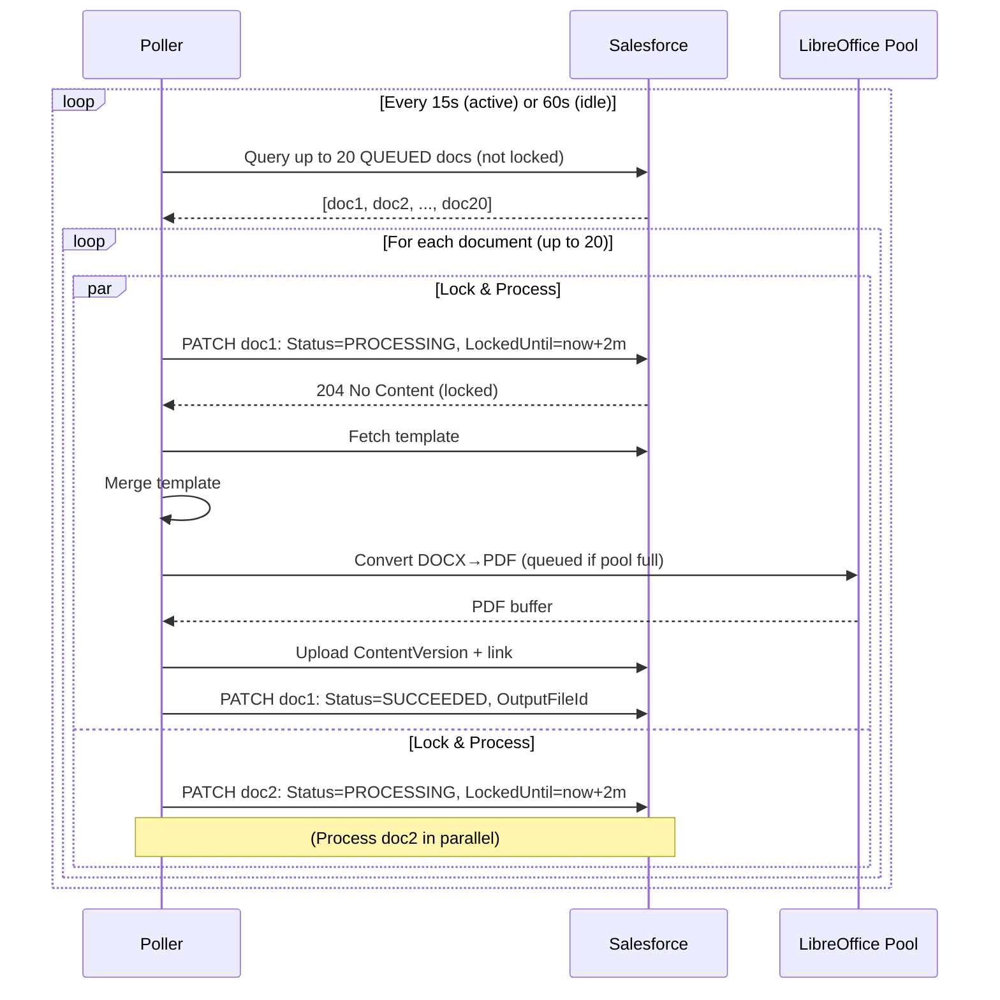
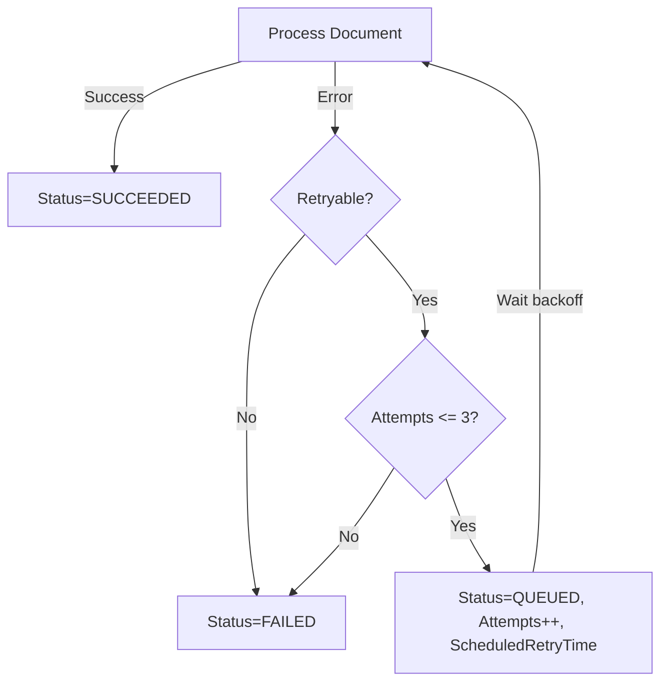

# Document Generation Poller — Architecture & Operations Guide

## Table of Contents

1. [Overview](#overview)
2. [Architecture](#architecture)
3. [Polling Strategy](#polling-strategy)
4. [Locking & Concurrency](#locking--concurrency)
5. [Retry Strategy & Backoff](#retry-strategy--backoff)
6. [API Limits & Mitigation](#api-limits--mitigation)
7. [Operational Runbook](#operational-runbook)
8. [Monitoring & Observability](#monitoring--observability)
9. [Troubleshooting](#troubleshooting)
10. [Configuration Reference](#configuration-reference)

---

## Overview

The **Document Generation Poller** is an internal worker service that continuously processes queued document generation jobs from Salesforce. It runs **within the same container** as the Fastify API server and is designed to handle **mass (batch) document generation** at scale.

### Key Features

- **Adaptive polling**: 15s interval when active, 60s when idle
- **Sequential locking**: PATCH-based lock acquisition to prevent double-processing
- **Bounded concurrency**: Leverages LibreOffice pool (max 8 concurrent conversions)
- **Retry with backoff**: 1m → 5m → 15m exponential backoff for retryable errors
- **Graceful shutdown**: Waits for in-flight jobs before stopping
- **API-controlled**: Start/stop via authenticated REST endpoints

### Design Principles

1. **Salesforce as the queue**: No separate message broker; `Generated_Document__c` rows are the queue
2. **Single-writer semantics**: Lock acquisition via PATCH prevents race conditions
3. **Fail-safe**: Expired locks are automatically reclaimed; retries handle transient failures
4. **Observable**: Metrics and logs track queue depth, processing rate, and failures

---

## Architecture

### Component Diagram

```
┌─────────────────────────────────────────────────────────────┐
│                     Azure Container App                      │
│                                                               │
│  ┌───────────────┐              ┌──────────────────────┐    │
│  │  Fastify API  │              │  Poller Worker       │    │
│  │  (T-13)       │              │  (T-14)              │    │
│  │               │              │                      │    │
│  │  /generate    │              │  15s polling loop    │    │
│  │  /worker/*    │◄─────────────┤  (adaptive)          │    │
│  │               │   control    │                      │    │
│  └───────────────┘              │  • Fetch QUEUED docs │    │
│                                 │  • Lock sequentially  │    │
│                                 │  • Process (max 8)    │    │
│                                 │  • Update status      │    │
│                                 │  • Retry/Backoff      │    │
│                                 └──────────────────────┘    │
│                                          │                   │
└──────────────────────────────────────────┼───────────────────┘
                                           │
                                           ▼
                              ┌────────────────────────┐
                              │      Salesforce        │
                              │                        │
                              │  Generated_Document__c │
                              │  • Status__c           │
                              │  • LockedUntil__c      │
                              │  • Attempts__c         │
                              │  • RequestJSON__c      │
                              └────────────────────────┘
```

### Process Flow



---

## Polling Strategy

### Adaptive Intervals

The poller uses **adaptive intervals** to balance responsiveness and API efficiency:

| Condition                | Interval | Rationale                                 |
|------------------------- |----------|-------------------------------------------|
| Queue depth > 0 (active) | 15s      | Rapid processing when work is available   |
| Queue depth = 0 (idle)   | 60s      | Reduce API calls when no work pending     |

**Implementation**:
```typescript
getPollingInterval(): number {
  if (this.currentQueueDepth > 0) return 15000; // 15s
  return 60000; // 60s
}
```

### Batch Size

- **Fetch limit**: 20 documents per poll cycle (configurable via `POLLER_BATCH_SIZE`)
- **Rationale**: Reduced from 50 to limit API burst (~100 calls/cycle vs ~250)
- **Concurrency**: All 20 documents processed in parallel, but LibreOffice pool caps conversions at 8

### Query Logic

**SOQL query** (executed every poll):
```sql
SELECT Id, Status__c, RequestJSON__c, Attempts__c, CorrelationId__c,
       Template__c, RequestHash__c, CreatedDate
FROM Generated_Document__c
WHERE Status__c = 'QUEUED'
  AND (LockedUntil__c < NOW() OR LockedUntil__c = NULL)
ORDER BY Priority__c DESC NULLS LAST, CreatedDate ASC
LIMIT 20
```

**Key points**:
- **Status = QUEUED**: Only fetch unprocessed documents
- **Lock filter**: Skip documents locked by another worker (LockedUntil >= now)
- **Priority ordering**: High-priority jobs processed first
- **FIFO within priority**: CreatedDate ASC for fairness

---

## Locking & Concurrency

### Lock Acquisition (Sequential)

Each document is locked **individually** via PATCH before processing:

```typescript
async lockDocument(documentId: string): Promise<boolean> {
  const lockUntil = new Date(Date.now() + LOCK_TTL_MS).toISOString();
  try {
    await sfApi.patch(`/sobjects/Generated_Document__c/${documentId}`, {
      Status__c: 'PROCESSING',
      LockedUntil__c: lockUntil
    });
    return true; // Lock acquired
  } catch (error) {
    return false; // Lock contention or error; skip this document
  }
}
```

**Why sequential?**
- **Simplicity**: No optimistic locking or custom lock table needed
- **Resilience**: Failed PATCH (e.g., record modified by another worker) safely skips the document
- **Idempotency**: Repeated calls are safe; lock TTL prevents indefinite locks

### Lock TTL & Expiry

- **Lock TTL**: 2 minutes (`POLLER_LOCK_TTL_MS = 120000`)
- **Expiry handling**: If a worker crashes, the lock expires after 2 minutes and the document becomes eligible for re-processing
- **Stale lock detection**: Next poll cycle will find `LockedUntil__c < NOW()` and reclaim the document

### Concurrency Control

- **Parallel processing**: All documents in a batch (up to 20) are processed concurrently via `Promise.allSettled`
- **LibreOffice pool limit**: Only 8 conversions run simultaneously; others queue internally
- **Memory safety**: 20 jobs × ~5MB avg payload = ~100MB working set (well within 4GB container limit)

---

## Retry Strategy & Backoff

### Retryable vs Non-Retryable Errors

**Non-retryable** (immediate FAILED):
- `404 Not Found` (template missing)
- `400 Bad Request` (invalid data)
- Template parse errors
- Non-transient validation errors

**Retryable** (requeue with backoff):
- `5xx` server errors
- Network timeouts
- Conversion timeouts
- Upload failures (transient Salesforce issues)

### Backoff Calculation

| Attempt | Backoff Delay | Rationale                              |
|---------|---------------|----------------------------------------|
| 1       | 1 minute      | Quick retry for transient blips        |
| 2       | 5 minutes     | Medium delay for intermittent issues   |
| 3       | 15 minutes    | Long delay before final attempt        |
| 4       | FAILED        | Max attempts exceeded; permanent fail  |

**Implementation**:
```typescript
computeBackoff(attempts: number): number {
  switch (attempts) {
    case 1: return 60000;    // 1 minute
    case 2: return 300000;   // 5 minutes
    case 3: return 900000;   // 15 minutes
    default: return 0;       // No more retries
  }
}
```

### Retry Flow



---

## API Limits & Mitigation

### Salesforce API Usage

**Per poll cycle** (20 documents):
- **1 SOQL query**: Fetch batch
- **20 PATCH calls**: Lock documents
- **20 GET calls**: Fetch templates (mostly cached)
- **~40 POST calls**: Upload PDF + optional DOCX
- **~40 POST calls**: Create ContentDocumentLinks (2 per file on average)
- **20 PATCH calls**: Update status
- **Total**: ~141 API calls per cycle

**Daily limit estimate** (24-hour active polling at 15s interval):
- **Cycles per day**: (86400s / 15s) = 5,760 cycles
- **API calls per day**: 5,760 × 141 = **812,160 calls**
- **Salesforce org limits**: Typically 15,000–100,000 calls/day (varies by edition)

### Mitigation Strategies

1. **Adaptive polling**: Idle mode reduces calls by 75% when queue is empty
2. **Template caching**: Immutable cache eliminates ~20 GETs per cycle (cached after first fetch)
3. **Batch size tuning**: Reduce `POLLER_BATCH_SIZE` from 20 to 10 if approaching limits
4. **Priority filtering**: Add `WHERE Priority__c >= threshold` to focus on high-priority jobs
5. **Horizontal scaling**: Each replica runs its own poller; distribute workload across multiple orgs if needed

### Alert Thresholds

- **Warning**: >70% of daily API limit consumed
- **Critical**: >90% of daily API limit consumed
- **Action**: Reduce batch size or pause poller (`POST /worker/stop`)

---

## Operational Runbook

### Always-On Architecture

**Note**: The poller **auto-starts** when the application starts and runs continuously on all replicas. In multi-replica deployments (Azure Container Apps with 1-5 replicas), each replica runs its own poller. The Salesforce lock mechanism (`LockedUntil__c`) prevents duplicate work across replicas.

**To stop polling entirely**:
- Scale the Azure Container App to 0 replicas
- Or terminate the application (SIGTERM/SIGINT triggers graceful shutdown)

**Graceful shutdown** (on SIGTERM/SIGINT):
1. Stops scheduling new poll cycles
2. Waits for in-flight jobs to complete (max ~5 minutes for longest conversion)
3. Application exits cleanly

**To reduce polling frequency**: Adjust `POLLER_INTERVAL_MS` environment variable and restart the application

### Checking Status

**GET /worker/status** (per-replica):
```bash
curl https://<domain>/worker/status \
  -H "Authorization: Bearer <AAD_TOKEN>"
```

**Response** (per-replica, may vary between requests):
```json
{
  "isRunning": true,
  "currentQueueDepth": 15,
  "lastPollTime": "2025-11-10T14:35:00Z",
  "correlationId": "..."
}
```

### Getting Detailed Stats

**GET /worker/stats**:
```bash
curl https://<domain>/worker/stats \
  -H "Authorization: Bearer <AAD_TOKEN>"
```

**Response**:
```json
{
  "isRunning": true,
  "currentQueueDepth": 15,
  "totalProcessed": 1247,
  "totalSucceeded": 1189,
  "totalFailed": 58,
  "totalRetries": 134,
  "lastPollTime": "2025-11-10T14:35:00Z",
  "uptimeSeconds": 43200,
  "correlationId": "..."
}
```

---

## Monitoring & Observability

### Key Metrics (T-15 Placeholder)

| Metric                     | Type    | Description                              |
|----------------------------|---------|------------------------------------------|
| `queue_depth`              | Gauge   | Current number of QUEUED documents       |
| `docgen_duration_ms`       | Histogram | Time per document (batch mode)        |
| `docgen_failures_total`    | Counter | Failed documents by reason               |
| `retries_total`            | Counter | Retry attempts (by attempt number)       |
| `poller_uptime_seconds`    | Gauge   | Poller runtime since start               |
| `in_flight_jobs`           | Gauge   | Active processing jobs                   |

### Log Queries (Structured Logs)

**Find stuck documents** (PROCESSING > 5 minutes):
```sql
-- Salesforce SOQL
SELECT Id, Status__c, LockedUntil__c, Attempts__c, Error__c
FROM Generated_Document__c
WHERE Status__c = 'PROCESSING'
  AND LockedUntil__c < NOW()
ORDER BY LockedUntil__c ASC
```

**Identify high-failure templates**:
```sql
-- Salesforce SOQL
SELECT Template__c, COUNT(Id) failures
FROM Generated_Document__c
WHERE Status__c = 'FAILED'
  AND CreatedDate = LAST_N_DAYS:7
GROUP BY Template__c
ORDER BY COUNT(Id) DESC
```

### Alerts

1. **Queue depth sustained high**: `queue_depth > 100` for > 15 minutes → Scale replicas or investigate bottleneck
2. **Failure rate spike**: `failures_total > 10%` of `totalProcessed` → Check Error__c patterns
3. **Poller down**: `isRunning = false` unexpectedly → Check container health and restart
4. **API limit warning**: Daily API usage > 70% → Reduce batch size or polling frequency

---

## Troubleshooting

### Symptom: Documents Stuck in PROCESSING

**Cause**: Worker crashed or timed out before updating status

**Investigation**:
1. Query for stuck documents:
   ```sql
   SELECT Id, LockedUntil__c, Attempts__c, CreatedDate
   FROM Generated_Document__c
   WHERE Status__c = 'PROCESSING'
     AND LockedUntil__c < NOW()
   ```
2. Check if `LockedUntil__c` is expired (older than 2 minutes)

**Resolution**:
- Poller will automatically reclaim these on the next poll cycle
- To force immediate processing: Manually set `Status__c = 'QUEUED'` and `LockedUntil__c = NULL`

---

### Symptom: High Retry Rate

**Cause**: Transient errors (network, Salesforce throttling, LibreOffice timeouts)

**Investigation**:
1. Check `Error__c` field for common patterns
2. Review logs for `correlationId` from failed documents
3. Check Salesforce API usage (Setup → System Overview → API Usage)

**Resolution**:
- **Network issues**: Verify Azure → Salesforce connectivity
- **Throttling**: Reduce `POLLER_BATCH_SIZE` or increase `POLLER_INTERVAL_MS`
- **LibreOffice timeouts**: Increase `CONVERSION_TIMEOUT_MS` (currently 60s)

---

### Symptom: Queue Depth Growing

**Cause**: Ingest rate exceeds processing rate

**Investigation**:
1. Check processing rate: `totalProcessed / uptimeSeconds`
2. Compare with batch insert rate from Apex
3. Review avg `docgen_duration_ms` metric

**Resolution**:
- **Scale horizontally**: Add more ACA replicas (poller runs in each instance)
- **Optimize templates**: Reduce complexity (fewer images, smaller tables)
- **Increase batch size**: Set `POLLER_BATCH_SIZE=30` (watch API limits)
- **Prioritize**: Add `WHERE Priority__c >= 5` to query to focus on high-priority jobs

---

### Symptom: Poller Won't Start (409 Conflict)

**Cause**: Poller already running in same container

**Investigation**:
1. Check status: `GET /worker/status`
2. Verify `isRunning: true`

**Resolution**:
- If legitimately stuck: `POST /worker/stop` then `POST /worker/start`
- If crash-looped: Check container logs for startup errors

---

### Symptom: High API Usage Alerts

**Cause**: Polling too frequently with large batch size

**Investigation**:
1. Calculate calls per cycle: `batchSize × 7` (avg per document)
2. Check polling interval: `15s` (active) or `60s` (idle)
3. Review Salesforce API usage dashboard

**Resolution**:
1. **Reduce batch size**: `POLLER_BATCH_SIZE=10` (halves API usage)
2. **Increase intervals**: `POLLER_INTERVAL_MS=30000`, `POLLER_IDLE_INTERVAL_MS=120000`
3. **Cache optimization**: Ensure template cache is enabled (should be automatic)
4. **Pause during off-hours**: Schedule `POST /worker/stop` during low-priority windows

---

## Configuration Reference

### Environment Variables

**Note**: Poller is always-on (auto-starts with application). No manual start/stop control.

| Variable                     | Default | Description                                      |
|------------------------------|---------|--------------------------------------------------|
| `POLLER_INTERVAL_MS`         | `15000` | Polling interval when queue active (15s)         |
| `POLLER_IDLE_INTERVAL_MS`    | `60000` | Polling interval when queue empty (60s)          |
| `POLLER_BATCH_SIZE`          | `20`    | Max documents to fetch per cycle                 |
| `POLLER_LOCK_TTL_MS`         | `120000`| Lock duration (2 minutes)                        |
| `POLLER_MAX_ATTEMPTS`        | `3`     | Max retries before marking FAILED                |

### Salesforce Fields (Generated_Document__c)

| Field                | Type      | Purpose                                      |
|----------------------|-----------|----------------------------------------------|
| `Status__c`          | Picklist  | QUEUED \| PROCESSING \| SUCCEEDED \| FAILED  |
| `LockedUntil__c`     | Datetime  | Lock expiry timestamp (TTL enforcement)      |
| `Attempts__c`        | Number    | Retry counter (0-3)                          |
| `Error__c`           | Long Text | Last error message (for troubleshooting)     |
| `ScheduledRetryTime__c` | Datetime | Earliest time for retry (backoff enforcement) |
| `RequestJSON__c`     | Long Text | Full DocgenRequest envelope                  |
| `CorrelationId__c`   | Text(36)  | UUID for distributed tracing                 |
| `Priority__c`        | Number    | Job priority (higher = process first)        |

---

## Best Practices

1. **Start small**: Begin with `POLLER_BATCH_SIZE=10` and tune upward based on API usage
2. **Monitor API limits**: Set alerts at 70% and 90% thresholds
3. **Use priorities**: Assign `Priority__c` to urgent jobs (e.g., interactive follow-ups)
4. **Test failure modes**: Simulate crashes (kill container) to verify lock reclamation
5. **Graceful deployments**: Scale down replicas gradually to allow in-flight jobs to complete
6. **Multi-replica safety**: Trust the lock mechanism - multiple pollers are safe by design
7. **Idempotency checks**: Apex should set `RequestHash__c` to prevent duplicate work
8. **Correlation tracing**: Use `CorrelationId__c` to trace documents through logs and metrics

---

## Summary

The Document Generation Poller is a **robust, adaptive worker** that processes queued documents with:
- **Resilience**: Lock TTL, retry backoff, and graceful shutdown
- **Efficiency**: Adaptive intervals, template caching, and bounded concurrency
- **Observability**: Structured logs, metrics, and status endpoints
- **Scalability**: Horizontal scaling via ACA replicas

For operational issues, refer to the **Troubleshooting** section and monitor **queue depth**, **API usage**, and **failure rates** closely.
